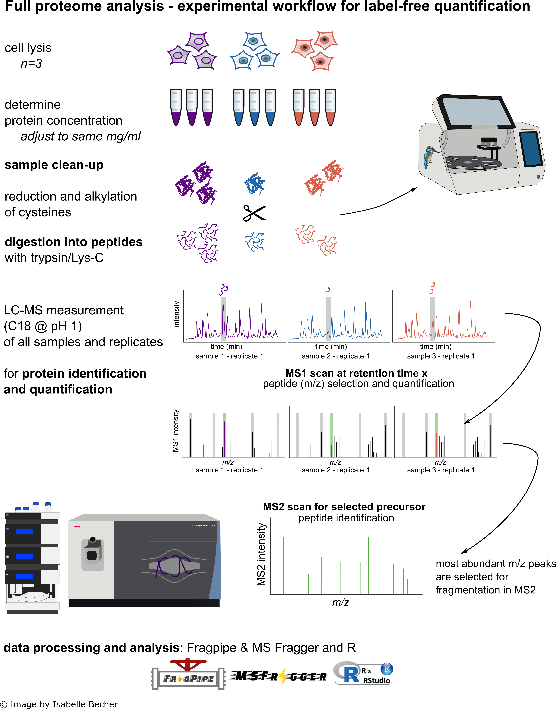
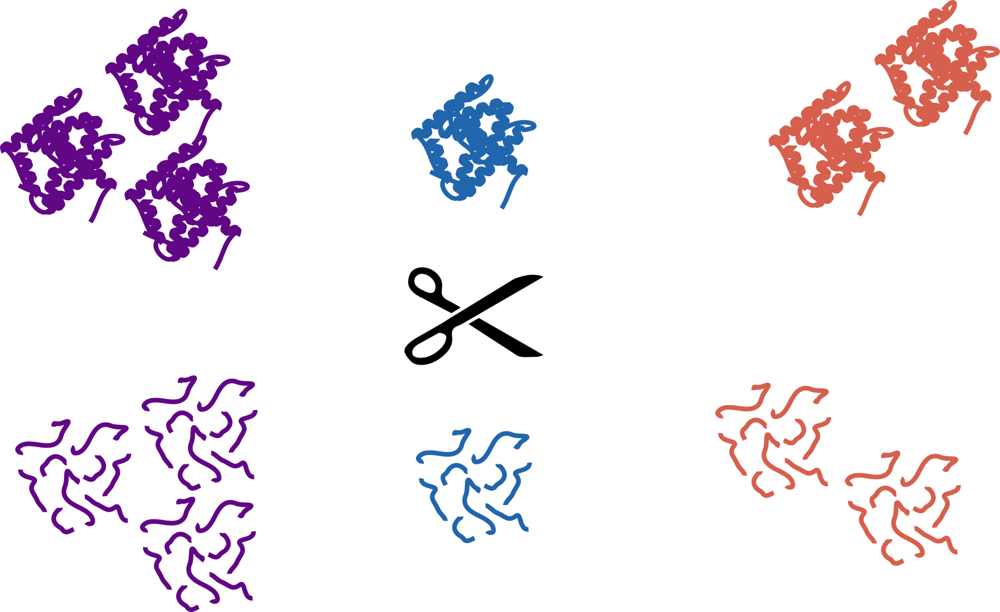
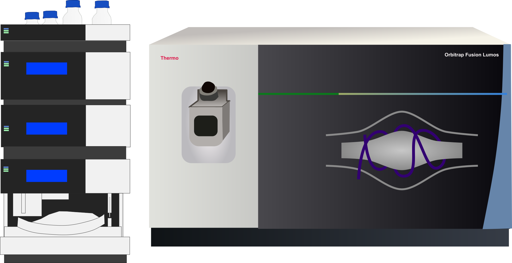
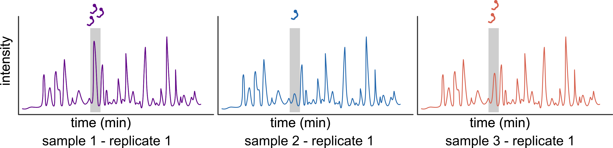
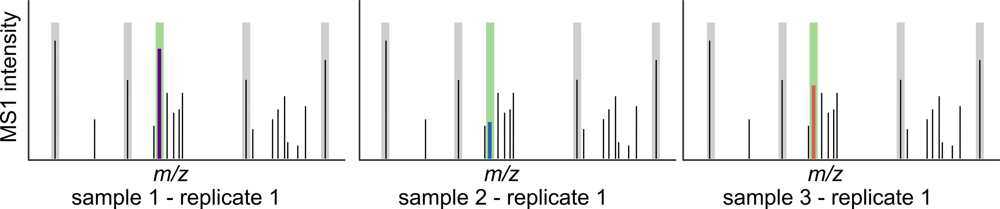
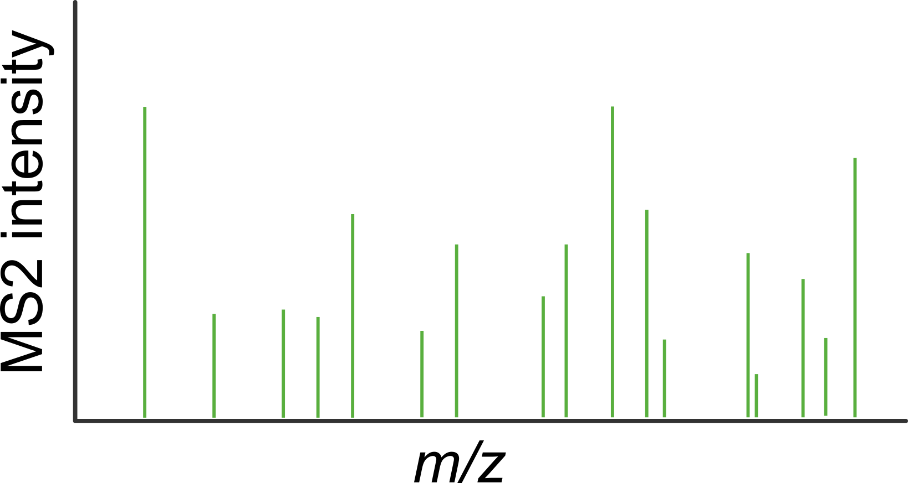

## **Data‑Dependent Acquisition (DDA) + Label‑Free Quantification (LFQ) Workflow**

## From samples to quantitative protein profiles (without labels)

In a **DDA‑LFQ** experiment, **each sample is measured sequentially in its own LC‑MS/MS run**. Peptides are identified from MS/MS spectra (MS2), and peptide/protein abundance is estimated from **chromatographic signal intensities** (typically MS1 feature areas). This makes LFQ flexible and scalable, but it also means that **run‑to‑run alignment** and **missing values** are central topics in the downstream analysis.

## Contents

1. [Workflow overview](#workflow-overview)
2. [Experimental design](#experimental-design)
3. [Protein preparation and enzymatic digestion](#protein-preparation-and-enzymatic-digestion)
4. [Liquid chromatography and mass spectrometry acquisition](#liquidchromatography-and-massspectrometry-acquisition)
5. [DDA: how peptides are selected for MS2 identification](#dda-how-peptides-are-selected-for-ms2-identification)
6. [LFQ: where the quantitative value comes from in DDA](#lfq-where-the-quantitative-value-comes-from-in-dda)
7. [Missing values and why they happen in LFQ](#missing-values-and-why-they-happen-in-lfq)
8. [Practical implications for data interpretation](#practical-implications-for-data-interpretation)

---

## Workflow overview

|  |
| :---- |
| Complete DDA‑LFQ workflow overview: from samples to protein abundance for each sample |

This documentation uses the same example design throughout (**9 samples** = **3 biological conditions** × **3 biological replicates**). In DDA‑LFQ, these 9 samples are **measured in 9 separate LC‑MS runs**; peptide signals are then aligned between runs and summarized to protein quantities. The most important downstream implications are **between‑run normalization**, **run‑to‑run alignment**, and typically **more missing values** (especially for low‑abundance peptides) compared to multiplexed methods.

## Experimental design

In label‑free proteomics, the mass spectrometer measures samples **one after another**, so it’s important to design your experiment so that real biological differences aren’t mixed up with differences caused by the order in which samples are measured.

|  |
| :---- |
| Figure 1: Experimental design example used throughout this documentation: 9 samples total (3 biological conditions, shown as different colours) with 3 biological replicates per condition. |

- **Biological replicates**: As a rule of thumb we recommend at least **three** biological replicates per condition; for subtle effects or noisy systems, **four to five** replicates can markedly increase power.
- **Randomization / blocking**: Randomize sample run order (or use a blocked design) so that each condition is spread across the acquisition sequence. This reduces the risk that instrument drift, column aging, or carryover effects mimic biology.
- **Batch awareness**: If the project must be acquired over multiple days/batches, distribute conditions across batches and include common QC samples to monitor performance.

The goal is simple: **differences in the output matrix should reflect biology, not measurement order.**

## Protein preparation and enzymatic digestion

When the samples arrive, proteins are processed using the **SP3 bead-based clean-up workflow** (Hughes lab), which efficiently removes contaminants such as detergents and salts. Proteins are reduced with Tris(2-carboxyethyl)phosphine (TCEP) and alkylated with chloroacetamide, preventing re‑formation of disulphide bridges and introducing a uniform **+57.021 Da carbamidomethyl** modification on cysteines. The proteins are then digested into peptides (typically with **trypsin**, cleaving after lysine and arginine), generating peptides in a mass range that ionises efficiently and yields predictable MS/MS fragmentation patterns (Figure 2).

|  |
| :---- |
| Figure 2: Protein digestion into peptides using a protease e.g. trypsin |

## Liquid‑chromatography and mass‑spectrometry acquisition

Each digested sample is injected onto a nano‑flow C18 column coupled to the mass spectrometer inlet (Figure 3). During the gradient, peptides are separated by hydrophobicity and elute at characteristic retention times, producing a series of Gaussian‑like peaks in the chromatogram (Figure 4).

|  |
| :---- |
| Figure 3: Mass spectrometer with an HPLC column. |

|  |
| :---- |
| Figure 4: HPLC chromatogram with a specific peptide eluting from the C18 column at retention time x. |

## DDA: how peptides are selected for MS2 identification

When peptides reach the emitter tip they are ionised and fly into the instrument. Then, the instrument records a full‑scan spectrum of all ions eluting from the LC column at that moment. This first survey scan is called **MS1** (Figure 5).

|  |
| :---- |
| Figure 5: MS1 scan (survey scan) at retention time x |

In **data‑dependent acquisition (DDA)** the instrument software then selects a limited number of precursor ions—typically the **most intense peaks** in MS1—for fragmentation. Each selected precursor is isolated in a narrow m/z window and fragmented (commonly by Higher energy Collision-induced Dissociation - HCD). The resulting fragment ions are recorded in an **MS2 spectrum** (Figure 6).

|  |
| :---- |
| Figure 6: MS2 spectrum of fragment ions of a selected MS1 precursor |

The MS2 spectrum contains:

- **Peptide backbone fragments** (higher m/z): used to infer the amino‑acid sequence by database search, yielding peptide identities with statistical confidence.
- **Other ions / noise**: co‑isolated species and chemical background can contribute, especially at low abundance.

## LFQ: where the quantitative value comes from in DDA

In label‑free quantification, abundance is most commonly estimated from **chromatographic peak areas** of peptide features (an MS1 signal traced over retention time). Conceptually:

1. **Detect chromatographic features**: detect peptide precursor isotope patterns in MS1 and trace them over retention time (often as extracted-ion chromatograms, XICs). A feature is defined by precursor m/z, charge/isotope pattern, and a chromatographic elution peak.
2. **Quantify by peak area (AUC)**: integrate the MS1 precursor signal over the elution peak (area under the chromatographic curve) to obtain a peptide-level intensity for that run.
3. **Identify peptides**: assign peptide sequences to features using MS2 database search results (and propagate the ID to the corresponding MS1 feature used for quantification).
4. **Align runs and summarize to proteins**: align retention times across runs and match the “same” peptide feature between LC‑MS runs, then aggregate peptide intensities into a protein-level quantity (e.g., median/mean of selected peptides, often after filtering to reduce interference).

### Match-between-runs (feature transfer)

In LFQ, a peptide can be **present** in multiple samples but still be **identified by MS2 only in some runs** (because DDA selects only a subset of precursors for fragmentation). *Match-between-runs* addresses this by transferring peptide IDs to runs where the peptide feature is detectable in MS1 but lacked an MS2 identification.

Conceptually, the algorithm does:

1. **Retention-time alignment** across runs (so the same peptide eluting at 52.3 min in run A can be found near the corresponding time in run B).
2. **Feature matching**: search in the target run for an MS1 feature with the same precursor m/z (within a tight tolerance) and a compatible retention time (after alignment), often also requiring similar isotope pattern/charge and good peak shape.
3. **Transfer the identification**: if the match is confident, assign the peptide identity from the identified run to the matched feature and use its MS1 area for quantification.

**Why it helps**: it can **reduce missing values** and improve the completeness of the protein × sample matrix, especially for lower-abundance peptides that are inconsistently selected for MS2.

**Important caveat**: transferring IDs can introduce **false matches** if retention-time alignment is poor or if many peptides have very similar m/z. Good workflows therefore keep tolerances tight, rely on robust alignment, and may use additional scoring/quality filters to limit incorrect transfers.

### Common protein quantification strategies you may encounter

Different pipelines can report slightly different “protein quantities”. All of them aim to summarize peptide evidence into a protein‑level number, but the assumptions differ. Common strategies include:

- **Raw intensity**: a direct summary of peptide signal (often a sum or mean/median across selected peptides). This is simple and intuitive but can be sensitive to missing peptides and to how peptides are filtered.
- **iBAQ (intensity‑Based Absolute Quantification)**: protein intensity is divided by the number of theoretically observable tryptic peptides for that protein. iBAQ is often used as a proxy for **within‑sample protein abundance ranking** (it is not truly absolute without standards), and it can help compare abundance *within* a sample.
- **MaxLFQ**: a label‑free method that infers protein quantities from a network of peptide ratios across runs and aims to improve **between‑sample comparability**, especially when not every peptide is observed in every run.
- **Top3 / Hi‑3**: protein quantity is estimated from the **three most intense peptides** (or a small fixed number). This can be robust when many peptides are noisy, but it assumes the top peptides are consistently observed and behave comparably between samples.

In some pipelines you may also see **razor intensity**: peptides that could belong to multiple protein groups (“shared peptides”) are assigned to the single group with the strongest overall evidence, and the resulting intensities are summarized at the protein level. This reduces double‑counting, but it means the reported quantity is tied to protein grouping and peptide assignment rules.

### What you will typically receive in your report

To avoid overwhelming users, our reports usually provide **one primary protein quantity** column that is used for downstream statistics and plots. Depending on the analysis strategy used for your project, this primary quantity may be:

- **iBAQ** (often useful for within‑sample abundance ranking),
- **razor intensity** (a straightforward intensity summary after protein grouping), or
- **MaxLFQ** (a between‑run comparable protein quantity).

The output is a **protein × sample matrix** that is used for QC, normalization, statistical testing and enrichment analysis.

## Missing values and why they happen in LFQ

Compared to multiplexed labeling, **DDA‑LFQ typically has more missing values**, and they are often abundance‑dependent:

- **Stochastic MS2 selection**: only a limited number of precursors are selected each cycle; low‑abundance peptides may not be chosen in every run even if they are present.
- **Run‑to‑run variability**: slight shifts in chromatography or ionization can change which peptides cross the selection threshold.
- **Identification limits**: a peptide feature may be present in MS1 but not confidently identified by MS2 in a given run.

Downstream analysis therefore spends a lot of attention on:

- **Feature alignment / “match between runs”** (to reduce missingness while controlling false matches)
- **Filtering** (e.g., requiring a peptide/protein to be observed in a minimum fraction of samples)
- **Imputation** (used cautiously; the right strategy depends on whether missingness looks random or intensity‑dependent)

## Practical implications for data interpretation

Because samples are acquired in separate runs, the analyst needs to watch a few recurring issues:

- **Run order effects / drift**: gradual changes in LC performance or source cleanliness can introduce systematic shifts. Good randomization and QC injections help detect and control this.
- **Between‑run normalization**: global intensity differences between runs are expected; normalization aims to make samples comparable without removing true biology.
- **Depth versus completeness trade‑off**: DDA can identify many peptides, but completeness across all samples can be limited—especially for low‑abundance proteins.

