# **From Raw Reporter Intensities to Biological Insight**

## A Gentle Walk‑through of the Statistical Pipeline

*This document accompanies the quantitative data you receive from the Proteomics Core Facility. It explains what the analysis script does, what files you receive, and how to interpret the key plots and CSV tables.*

---

## Quick start (if you only have 10 minutes)

All outputs are written into the folder **`data_analysis_results_V1/`**.

A practical order to look at results:

- **QC first**
  - `Identification_CountOverview_V1.pdf` (Figure 1)
  - `Identification_MissingValueOverview_V1.pdf` (Figure 3)
  - `Normalization_overview_V1.pdf` and `Normalization_overview_ratios_V1.pdf` (Figures 4–5)
  - `PCA_analysis_V1.pdf` and `CV_overview_V1.pdf` (Figures 7–8)
- **Then differential abundance (statistics)**
  - `Volcano_plot_V1.pdf`, `MA_plot_V1.pdf` (Figures 9 and 12)
  - `Limma_results_V1.csv` (main statistics table)
- **Then biology / patterns**
  - `Heatmap_hits_161_proteins_V1.pdf` (Figure 15)
  - clustering plots (Figures 16–19)
  - GO enrichment dotplots (Figures 20–21)

*(Note: the text below mentions **PDF** names because this README is also used as a template for reports. In this example folder the corresponding plots are stored as high‑resolution `*.png` files.)*

---

# Experimental setup

In order to explain the outputs of a typical data analysis, we use an example with **three biological conditions** and **three biological replicates** each:

- **wt** (wild-type)
- **single_ko** (SGPL1 knock-out)
- **double_ko** (SGPL1 knock-out + a second KO that did not work)

All samples were multiplexed using tandem mass tags (TMT), combined into a single sample, offline-fractionated, and measured in 12 fractions on an Orbitrap Fusion Lumos.

# Pre data analysis steps

The mass spectrometer produces raw files containing MS1 and MS2 spectra. These raw files were analyzed with FragPipe, which exported a `protein.tsv` file (tab-delimited text) as input for the downstream data analysis.

For reproducibility and transparency, an R Markdown script (`TMT_analysis_1_V1.Rmd`) is provided. It uses `metadata.csv` to map TMT channels to samples, conditions, and replicate information. Every figure and table is written to `data_analysis_results_V1/` alongside a frozen `Workspace_V1.RData`.

---

# Data analysis

## Reading and filtering protein files

The analysis script reads the file(s) listed in `metadata.csv` and stacks them into one long table, discarding:

- **reverse hits** (decoy matches)
- **contaminants**

Only proteins supported by at least **two razor peptides** are kept. This first filter reduces false identifications.

> Note on protein inference: FragPipe uses an “Occam’s razor” strategy. Shared peptides are assigned to the protein group with the strongest evidence (often the one with the most unique peptides).

## Protein identification overview

### Identification counts

Figure 1 shows how many proteins remain after filtering (e.g. `Razor.Peptides >= 2`) in each sample.

| 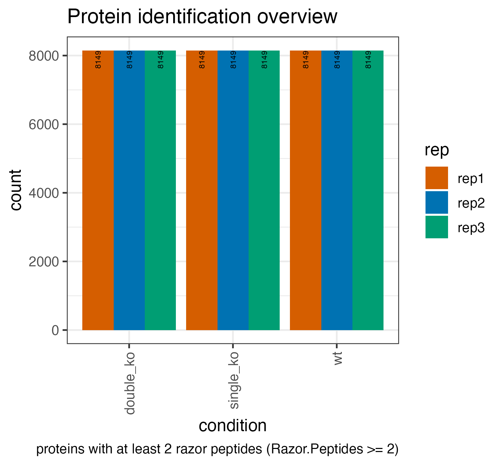 |
| :---- |
| Figure 1: `Identification_CountOverview_V1.pdf` — number of quantified proteins per sample. |

**How to read Figure 1**

- In a TMT experiment, all channels are measured together. Therefore counts are often similar across channels.
- Large differences can indicate issues (sample mix-up, channel failure, very unbalanced sample load, or metadata mismatch).

### UpSet plot (presence/absence across samples)

Figure 2 summarizes which proteins are present across samples.

|  |
| :---- |
| Figure 2: `Identification_UpSet_plot_V1.pdf` — UpSet plot showing intersections across samples. |

**How to read Figure 2**

- Each row corresponds to a sample.
- A vertical set of filled circles indicates a specific combination of samples.
- The bar above that combination is the number of proteins present in exactly that combination.

In this example, all **8149 proteins** have quantitative values for all 9 samples.

### Missing value / identification pattern heatmap

If identifications differ between samples, the analysis also provides a heatmap to explore missingness.

| 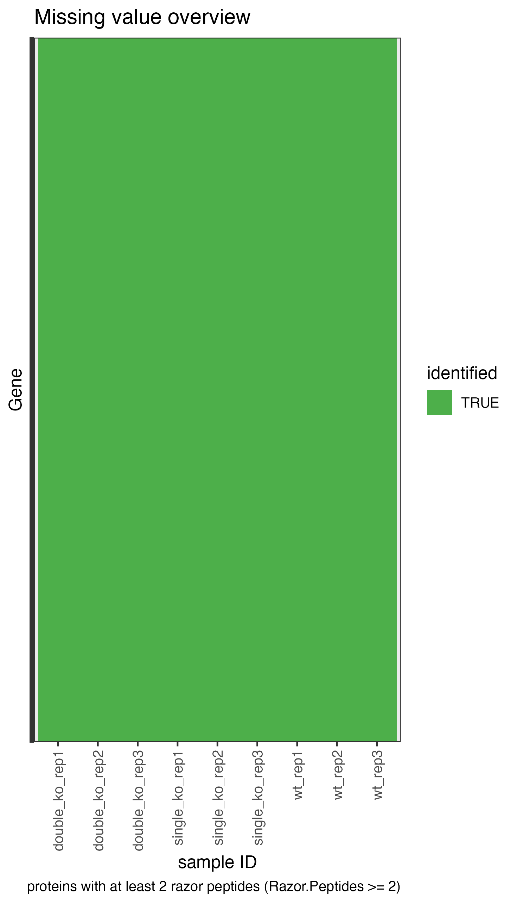 |
| :---- |
| Figure 3: `Identification_MissingValueOverview_V1.pdf` — heatmap showing missing value patterns across samples. |

**How to read Figure 3**

- Rows are proteins; columns are samples.
- Green indicates a measured quantitative value.
- Grey indicates a missing value.

A protein may be “identified” (MS2 spectrum exists) but have reporter intensity close to zero in a specific channel; this appears as missing/zero in quantitative tables.

---

## Data transformation steps

### Log2 transformation

Intensities are log2 transformed (after creating an expression set) because log2 intensities are closer to normal distributions, which is a key assumption for many statistical methods.

### Cleaning technical batch effects

Subtle differences in chromatography or instrument performance can bias intensities. The script applies `removeBatchEffect()` (limma) using replicate information as a batch covariate.

### Variance‑stabilising normalization (VSN)

Reporter intensities span orders of magnitude. VSN rescales data so that variance is less dependent on signal size and sample distributions become comparable.

### Imputation

In TMT datasets missing values are often rare. For LFQ/DIA, missingness is more common and imputation strategies can be applied (kNN for missing-at-random; left-censored imputation for missing-at-low-abundance). In this example, the dataset is complete after filtering.

### Setting each sample relative to its control (ctrl.ratio)

For intuitive visualization, the script divides each sample’s normalized intensity by the **median** of its corresponding control channels and then uses log2 ratios downstream. This creates `ctrl.ratio_*` values.

---

## Inspecting the effects of data transformation

### Boxplots of intensities across steps

Figure 4 summarizes distributions across samples and processing steps.

| 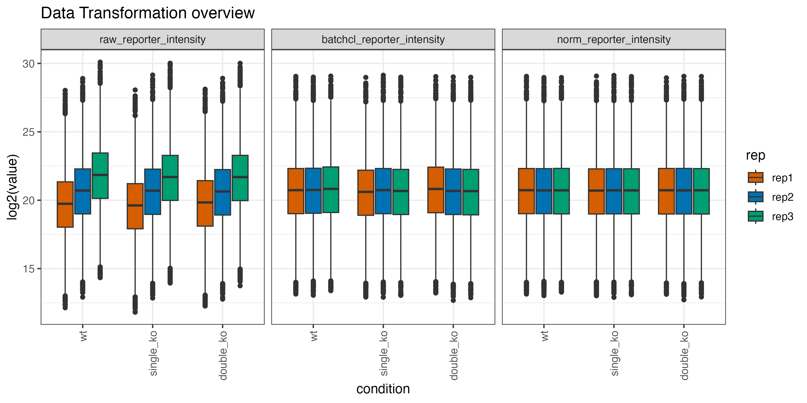 |
| :---- |
| Figure 4: `Normalization_overview_V1.pdf` — distributions across transformation steps. |

**How to read Figure 4**

- Each box shows the distribution of (log2) protein abundances per sample.
- Compare the panels:
  - **raw_reporter_intensity**: raw values
  - **batchcl_reporter_intensity**: after batch-effect removal
  - **norm_reporter_intensity**: after normalization

If samples show systematic shifts (e.g. rep1 < rep2 < rep3), batch correction should reduce that pattern.

### Boxplots of control ratios

Figure 5 shows the distribution of control ratios.

| 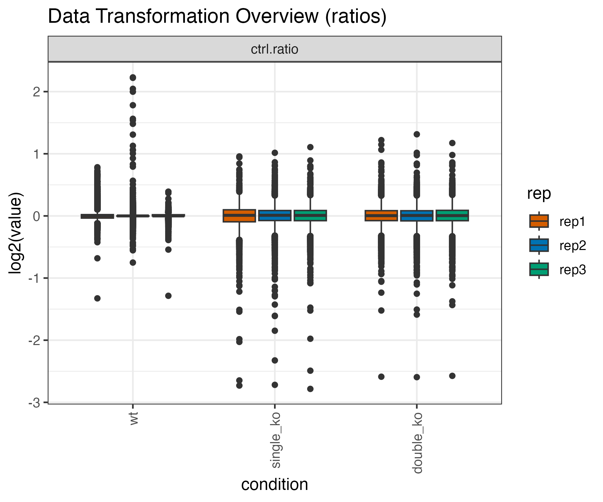 |
| :---- |
| Figure 5: `Normalization_overview_ratios_V1.pdf` — distributions of control ratios. |

**How to read Figure 5**

- The median of the control condition is expected to be near **0** (because log2(1) = 0).
- Wide distributions reflect biological variation and/or technical noise.

### Example protein plot (SGPL1)

For intuition, it is helpful to look at one protein across all transformation steps.

| 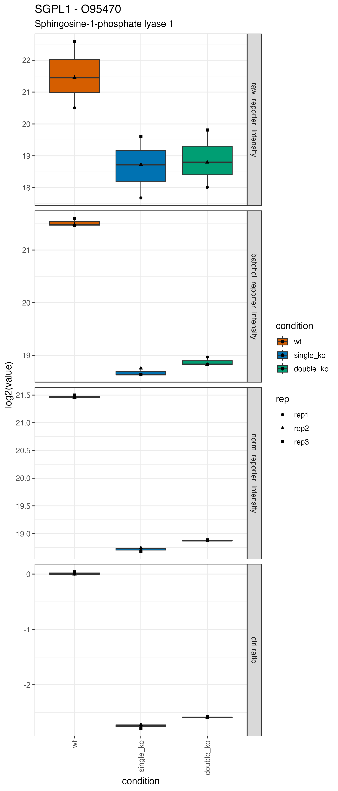 |
| :---- |
| Figure 6: `all_proteins_V1.pdf` — per-protein overview across transformation steps (example shown for SGPL1). |

In this example folder the script also produces a dedicated figure:

- `SGPL1_protein_plot_V1.pdf` (stored as `SGPL1_protein_plot_V1.png` in `data_analysis_results_V1/`)

The plot shows:

- conditions as colors
- replicates as point shapes
- multiple panels for raw / batch-corrected / normalized / ctrl.ratio

### PCA analysis

A principal component analysis (PCA) summarizes sample similarity.

| 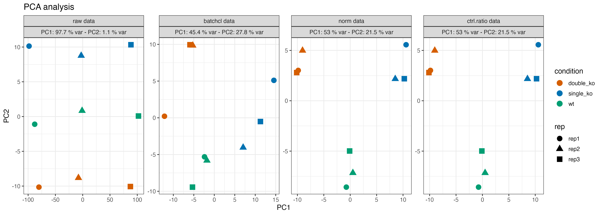 |
| :---- |
| Figure 7: `PCA_analysis_V1.pdf` — PCA at each transformation step. |

**How to read Figure 7**

- Each dot is a sample.
- The closer dots are, the more similar their overall proteome profile.
- If samples cluster by replicate rather than by condition before correction, batch effects are likely.

The underlying coordinates are saved in:

- `PCA_analysis_data_V1.csv`

### CV calculation

The coefficient of variation (CV) summarizes reproducibility across replicates.

|  |
| :---- |
| Figure 8: `CV_overview_V1.pdf` — CV distributions per condition and processing step. |

**How to read Figure 8**

- Lower CV generally indicates better reproducibility.
- The “all” group mixes conditions and is therefore expected to have higher CV.

---

## Differential abundance analysis (limma)

The core test is an **empirical Bayes moderated t-test** (limma) comparing predefined contrasts (e.g. `double_ko - wt`). The model accounts for replicate information and controls FDR across thousands of proteins.

The main result table is:

- `Limma_results_V1.csv`

### Volcano plot

| 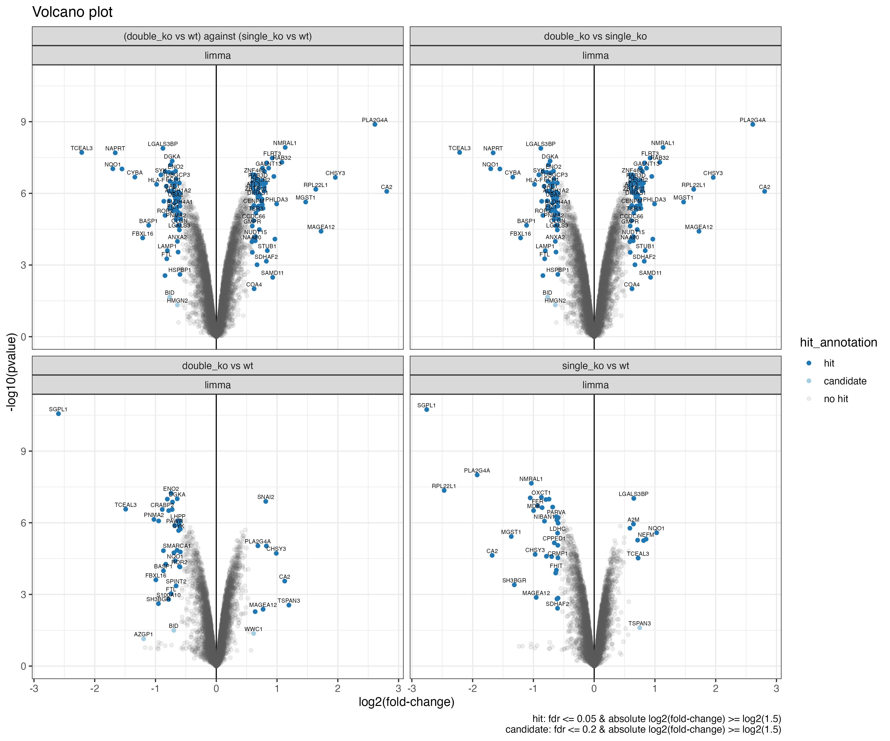 |
| :---- |
| Figure 9: `Volcano_plot_V1.pdf` — log2 fold-change vs significance. |

**How to read Figure 9**

- X-axis: **log2 fold-change** (positive = higher in numerator of the contrast).
- Y-axis: **-log10(p-value)** (higher = more significant).
- Points are colored by hit class:
  - **hit**: FDR ≤ 0.05 and |FC| ≥ 1.5
  - **candidate**: FDR ≤ 0.2 and |FC| ≥ 1.5

### Fold-change correlation plot

A ratio-of-ratios comparison can be easier to interpret as a correlation of two fold-changes.

| 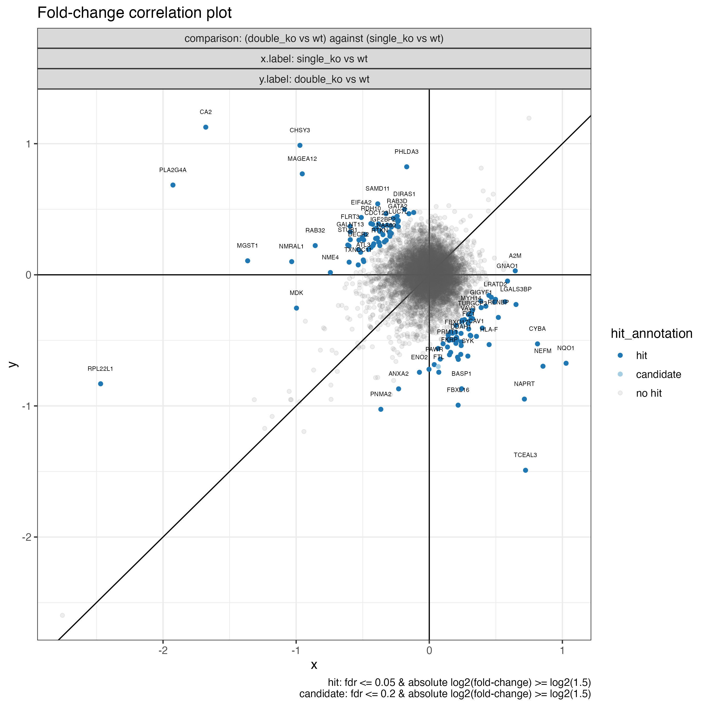 |
| :---- |
| Figure 10: `Fold_change_correlation_V1.pdf` — correlation of fold-changes from two contrasts. |

| 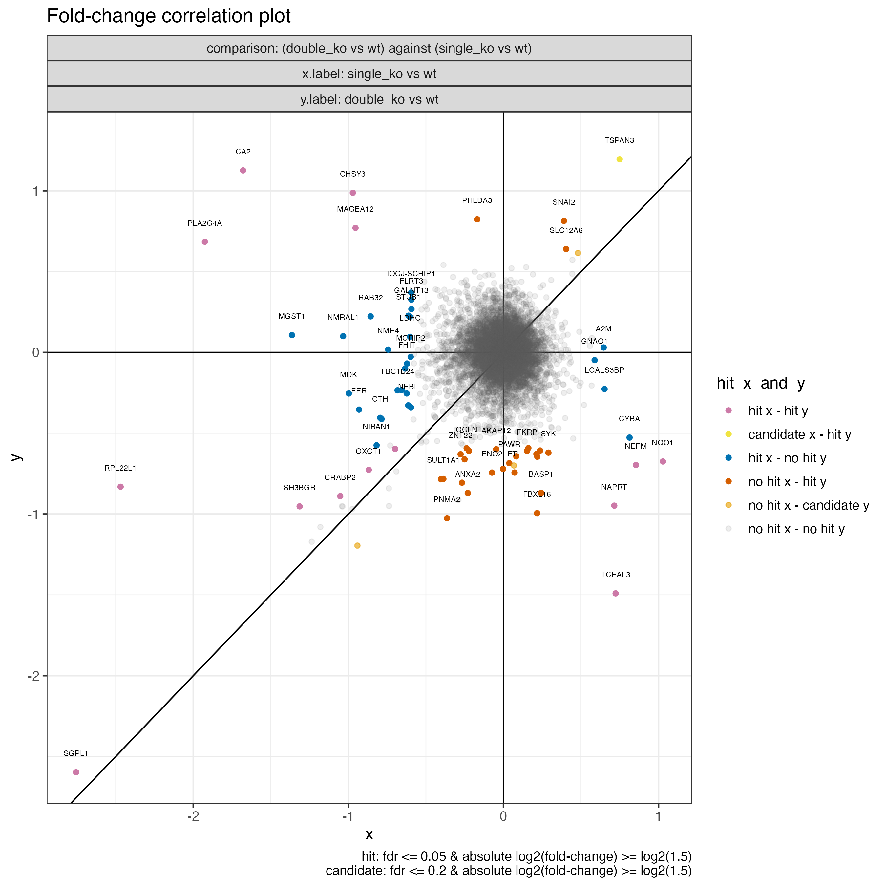 |
| :---- |
| Figure 11: `Fold_change_correlation_alt_hit_class_V1.pdf` — same plot, colored by hit annotations per comparison. |

### MA plot

| 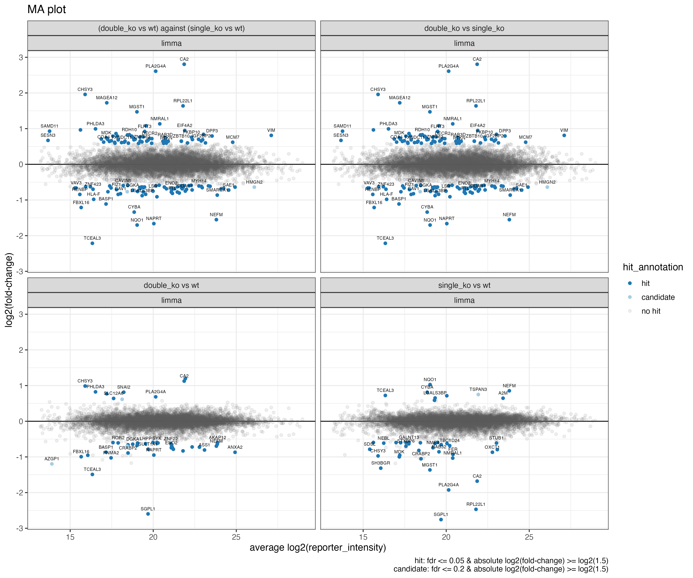 |
| :---- |
| Figure 12: `MA_plot_V1.pdf` — fold-change vs average abundance. |

**How to read Figure 12**

- X-axis: average abundance (log scale).
- Y-axis: log2 fold-change.
- This plot helps detect abundance-dependent artifacts (often low-abundance proteins show higher noise).

Additional plot in the results folder (useful for IP-style experiments):

- `MA_Total.Intensity_plot_V1.pdf` (stored as `MA_Total.Intensity_plot_V1.png`) — fold-change vs overall protein abundance proxy (`Total.Intensity`).

### t-value vs FDR and p-value histogram

| 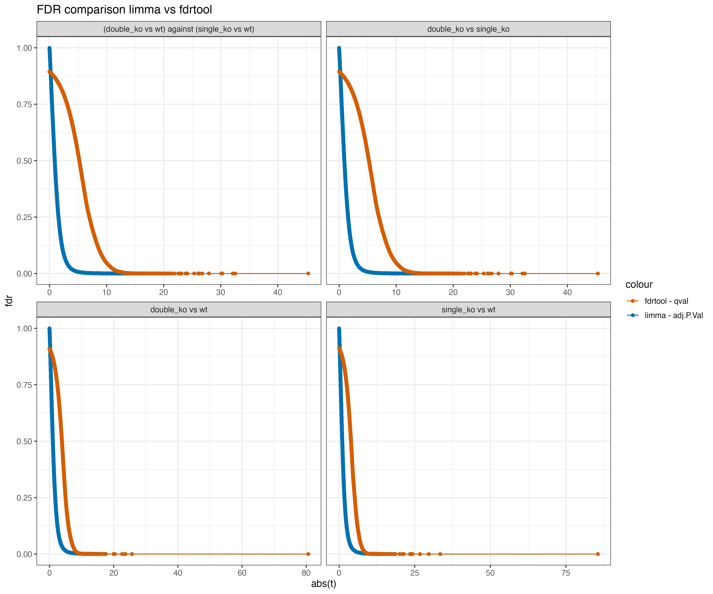 |
| :---- |
| Figure 13: `t_vs_fdr_limma_vs_fdrtool_V1.pdf` — relationship between t-statistics and estimated FDR. |

| 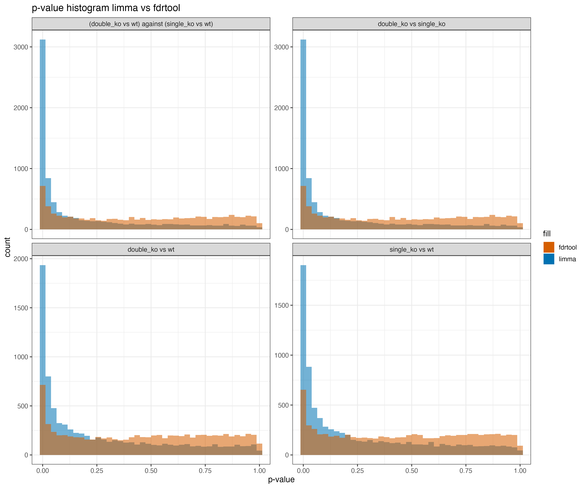 |
| :---- |
| Figure 14: `p-value_histogram_limma_vs_fdrtool_V1.pdf` — p-value distributions. |

---

## Heatmaps and clustering

### Heatmap of regulated proteins

| 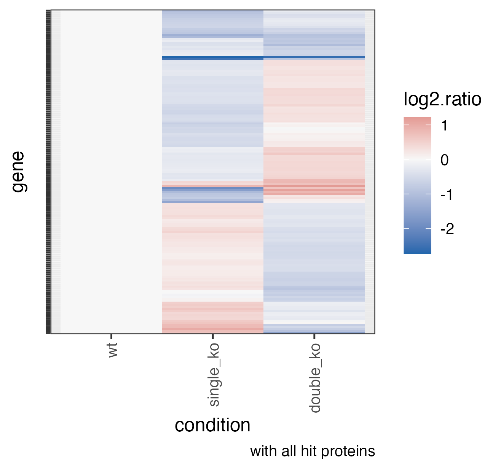 |
| :---- |
| Figure 15: `Heatmap_hits_161_proteins_V1.pdf` — heatmap of hit/candidate proteins (median ctrl.ratio per condition). |

**How to read Figure 15**

- Rows: proteins; columns: conditions.
- Colors represent log2(ctrl.ratio) (relative to control).
- This plot emphasizes *patterns* (up/down across conditions) rather than single p-values.

### Choosing the number of clusters (silhouette)

| 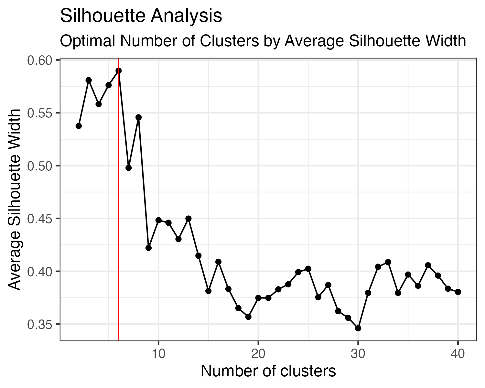 |
| :---- |
| Figure 16: `Clustering_Silhouette_plot_161_proteins_V1.pdf` — silhouette analysis for selecting cluster number. |

**How to read Figure 16**

- X-axis: number of clusters.
- Y-axis: average silhouette width (higher = better separated clusters).
- The vertical line indicates the selected cluster number (here: 6).

### Clustering PCA and heatmap

| 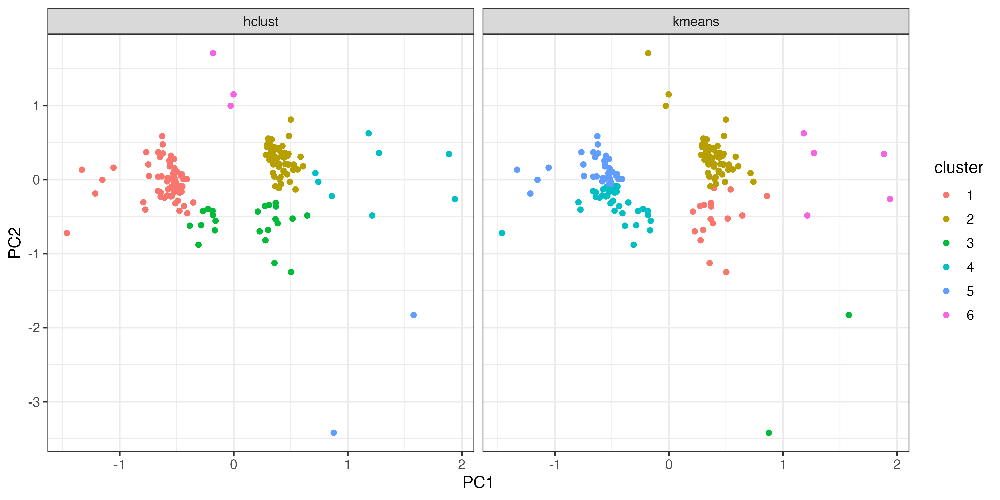 |
| :---- |
| Figure 17: `PCA_clustering_data_6_cluster_161_proteins_V1.pdf` — PCA of clustered proteins, colored by cluster. |

| 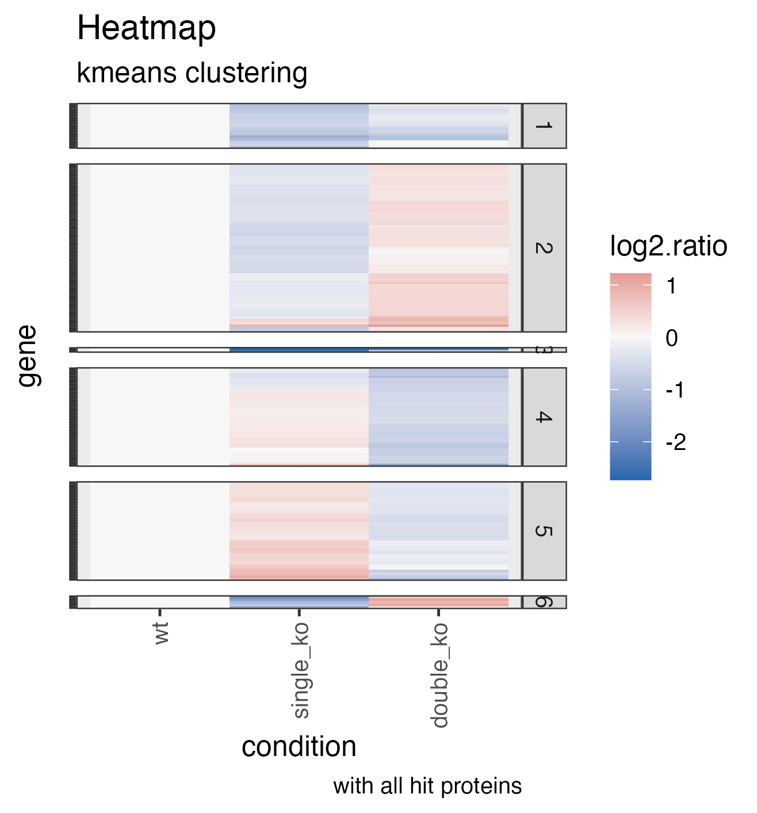 |
| :---- |
| Figure 18: `Clustering_heatmap_hits_kmeans_6_cluster_161_proteins_V1.pdf` — k-means clustered heatmap. |

### Cluster trend line plots

| 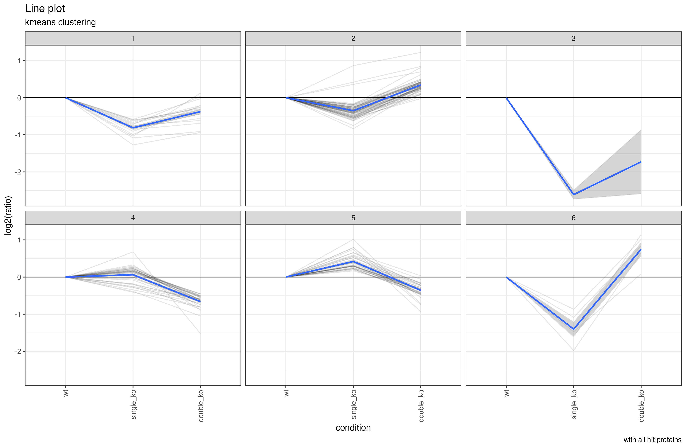 |
| :---- |
| Figure 19: `Clustering_line_plot_kmeans_6_cluster_161_proteins_V1.pdf` — cluster-average trends across conditions. |

Additional clustering outputs in `data_analysis_results_V1/` (optional but helpful):

- `Clustering_heatmap_hits_hclust_6_cluster_161_proteins_V1.pdf` (stored as `*.png`) — the same heatmap but grouped by hierarchical clustering.
- `Clustering_line_plot_hclust_6_cluster_161_proteins_V1.pdf` (stored as `*.png`) — trend lines per hierarchical cluster.
- `Clustering_Correlation_hclust_vs_kmeans_161_proteins_V1.png` — how the two clustering methods agree/disagree for each protein.

---

## Gene Ontology (GO) enrichment

GO enrichment is performed at two levels:

- **Differential abundance**: hits/candidates are split by comparison and direction (up/down)
- **Clustering**: proteins are grouped by cluster

### GO for differential abundance analysis (example: MF)

| 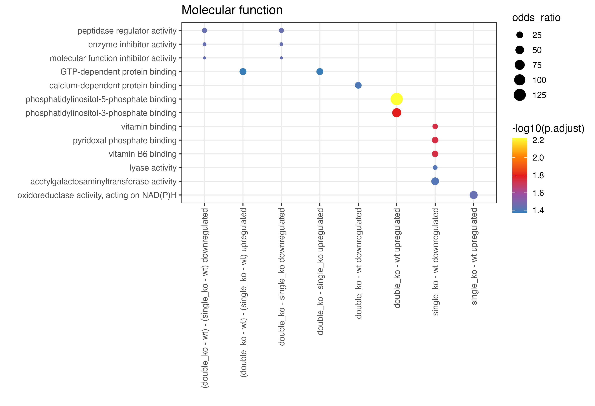 |
| :---- |
| Figure 20: `GO_enrichment_DE_MF_dotplot_limma_results_V1.pdf` — GO enrichment for differential abundance results. |

### GO for clustering results (example: MF)

| 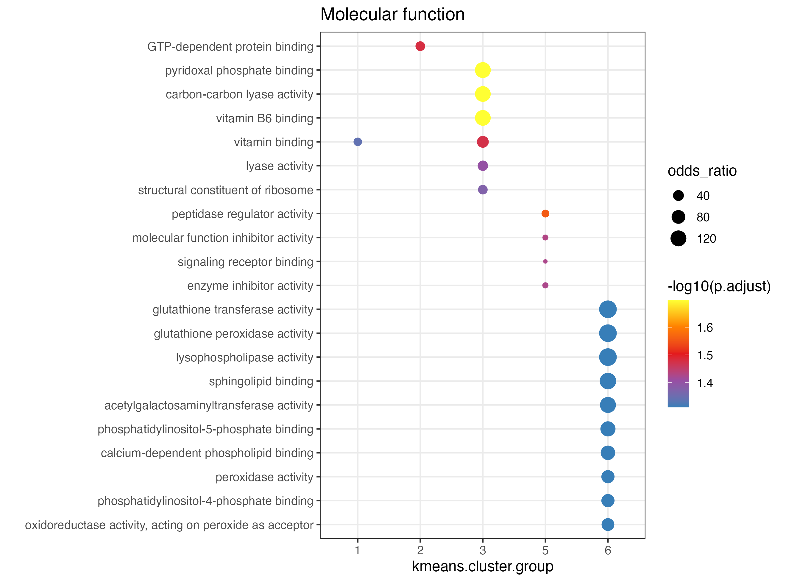 |
| :---- |
| Figure 21: `GO_enrichment_cluster_MF_dotplot_kmeans_clustering_V1.pdf` — GO enrichment per cluster. |

**How to read GO dotplots**

- Each dot is a GO term.
- Color indicates significance (adjusted p-value).
- Dot size represents enrichment strength (odds ratio / fold enrichment).
- Always cross-check:
  - how many genes drive a term (`Count`)
  - which genes drive it (`geneID`)

---

# CSV outputs (what they are, and what the columns mean)

This section documents the main `*.csv` tables in `data_analysis_results_V1/`.

## 1) `Full_dataset_V1.csv` (main wide table)

**What it is**: one row per protein (Gene), with sample-level intensities at several processing stages.

**Annotation columns**

- **Gene**: gene symbol used as primary identifier.
- **Protein.ID**: accession(s) (often UniProt).
- **Protein.Description**: description string.
- **Organism**: organism.
- **found.in.files / found.in.conditions / found.in.reps**: counts of where the protein was observed.
- **max.Unique.Peptides / max.Razor.Peptides**: identification evidence.
- **average.Total.Intensity**: mean abundance proxy (useful for abundance-dependent QC).

**Intensity column blocks (by prefix)**

- **`reporter_intensity_<condition>_<rep>`**: raw reporter intensities (summed per protein).
- **`batchcl_reporter_intensity_<condition>_<rep>`**: after batch-effect removal.
- **`norm_reporter_intensity_<condition>_<rep>`**: after VSN normalization.
- **`ctrl.ratio_<condition>_<rep>`**: intensity relative to the control median (used for heatmaps/clustering).

## 2) `Identification_Overview_V1.csv` (presence/absence matrix)

- Rows are protein identifiers (in this example: `Gene_ProteinID`-style).
- Columns are samples (e.g. `wt_rep1`).
- Values:
  - **1** = present/quantified
  - **0** = missing

This table backs the UpSet plot and missingness heatmap.

## 3) `PCA_analysis_data_V1.csv`

Each row describes one sample in one processing layer.

- **PC1, PC2, PC3**: PCA coordinates.
- **PC1.var, PC2.var**: percent variance explained.
- **condition, rep**: sample annotation.
- **measurement**: raw vs batch-corrected vs normalized vs ctrl.ratio.

## 4) `Limma_results_V1.csv` (main statistics table)

One row per protein **per comparison**.

Core statistics:

- **comparison / comparison.label**: contrast tested.
- **logFC**: log2 fold-change.
- **AveExpr**: average abundance (log scale).
- **t**: moderated t-statistic.
- **pvalue.limma, fdr.limma**: limma p-value and FDR.
- **pvalue.fdrtool, qval.fdrtool, lfdr.fdrtool**: alternative estimates (used for some comparisons).

Hit labeling:

- **hit_annotation_method**: whether limma or fdrtool FDR was used.
- **pvalue, fdr**: the selected p-value/FDR.
- **hit**: TRUE/FALSE.
- **hit_annotation**: `hit`, `candidate`, `no hit`.

## 5) `Fold_change_correlation_data_V1.csv`

Data behind the fold-change correlation plots.

- **x, y**: log2FCs for the two comparisons.
- **x.label, y.label**: labels for axes.
- **x.hit, y.hit**: hit class in each comparison.
- **hit_annotation**: hit class in the ratio-of-ratios.
- **hit_x_and_y**: combined category used for coloring.

## 6) Clustering tables

- **`Clustering_data_161_proteins_V1.csv`**: condensed matrix used for clustering/heatmaps.
  - Columns: `double_ko`, `single_ko`, `wt` (median ctrl.ratio per condition).
- **`Cluster_results_6_cluster_161_proteins_V1.csv`**: cluster assignments.
  - **kmeans.cluster.group** and **hclust.cluster.group**.

## 7) GO enrichment tables

There are two families:

- **Differential abundance GO**:
  - `GO_enrichment_DE_CC_limma_results_V1.csv`
  - `GO_enrichment_DE_MF_limma_results_V1.csv`
  - `GO_enrichment_DE_BP_limma_results_V1.csv`

- **Cluster GO**:
  - `GO_enrichment_cluster_CC_kmeans_clustering_V1.csv`
  - `GO_enrichment_cluster_MF_kmeans_clustering_V1.csv`
  - `GO_enrichment_cluster_BP_kmeans_clustering_V1.csv`

Common columns (most important ones):

- **ID / Description**: GO term.
- **GeneRatio**: “hits in term / total hits in group”.
- **BgRatio**: “background genes in term / total background”.
- **pvalue / p.adjust / qvalue**: enrichment significance.
- **Count**: number of genes from your group contributing.
- **geneID**: genes contributing to the term.
- **odds_ratio / FoldEnrichment**: enrichment effect size.

---

# Methods and reproducibility

- **`Methods_V1.txt`**: a copy/paste-ready description of the analysis steps and thresholds.
- **`Workspace_V1.RData`**: a frozen R session containing all objects created by the analysis script.

---

## Questions / feedback

If any step feels unclear, please contact the Proteomics Core Facility team. If you tell us:

- which comparison you care about (e.g. `single_ko - wt`)
- whether you care more about strong fold-changes or subtle changes
- your downstream goal (pathway analysis, candidate list, QC)

…we can help you interpret the most relevant parts quickly.
