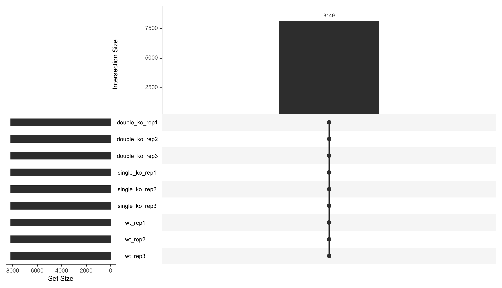
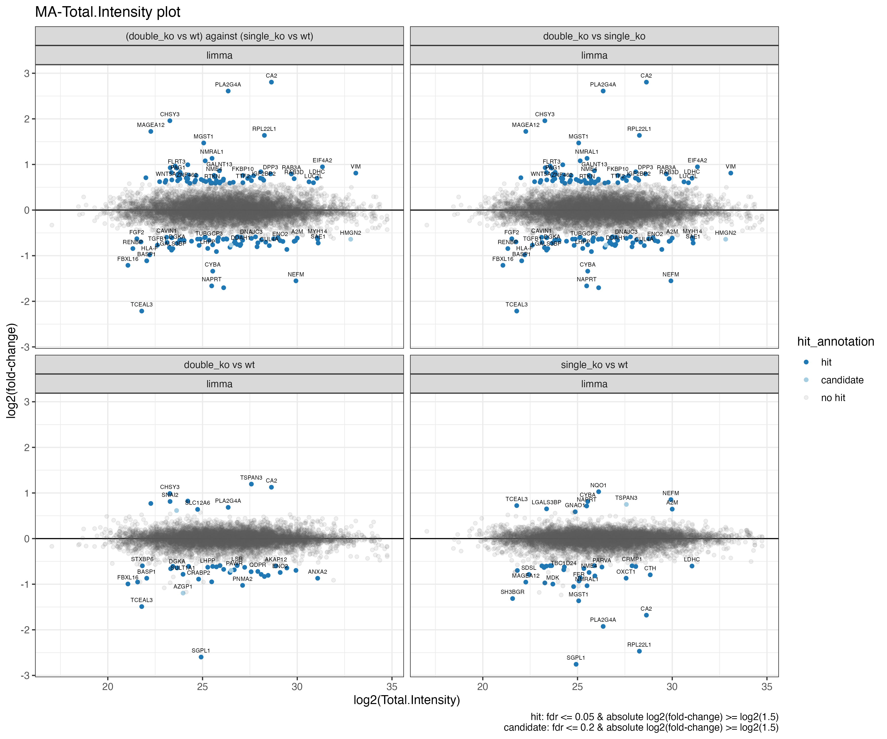
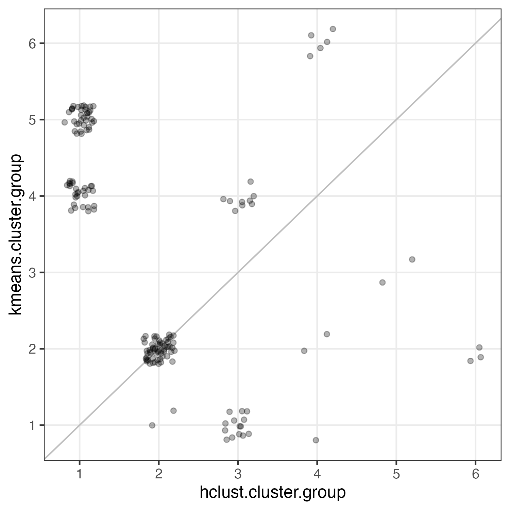

# **From Raw Reporter Intensities to Biological Insight**

## A Gentle Walk‑through of the Statistical Pipeline

*This document accompanies the quantitative data you receive from the Proteomics Core Facility (PCF) at the European Molecular Biology Laboratory (EMBL). It explains what the analysis script does, what files you receive, and how to interpret the key plots and CSV tables.*

## Contents

1. [Quick start](#quick-start)
2. [Experimental setup](#experimental-setup)
3. [Input files for the data analysis](#input-files-for-the-data-analysis)
4. [Data analysis](#data-analysis)
5. [Protein identification overview](#protein-identification-overview)
6. [Data transformation steps](#data-transformation-steps)
7. [Inspecting the effects of data transformation](#inspecting-the-effects-of-data-transformation)
8. [Differential abundance analysis (limma)](#differential-abundance-analysis-limma)
9. [Heatmaps and clustering](#heatmaps-and-clustering)
10. [Gene Ontology (GO) enrichment](#gene-ontology-go-enrichment)
11. [CSV outputs](#csv-outputs)
12. [Methods and reproducibility](#methods-and-reproducibility)

---

## Quick start

All outputs are written into the folder **`data_analysis_results_V[version number]/`** (for example, `data_analysis_results_V1/`, `data_analysis_results_V2/`, etc.). In this document we will use **V1**, as this is the first version you receive.

A practical order to look at results:

- **Quality Control (QC) first**
  - `Identification_CountOverview_V1.pdf` (Figure 1)
  - `Identification_MissingValueOverview_V1.pdf` (Figure 3)
  - `Normalization_overview_V1.pdf` and `Normalization_overview_ratios_V1.pdf` (Figures 4–5)
  - `PCA_analysis_V1.pdf` and `CV_overview_V1.pdf` (Figures 7–8)
  - 'all_proteins_V1.pdf' (see Figure 6 as example output)
- **Then differential abundance (statistics)**
  - `Volcano_plot_V1.pdf`, `MA_plot_V1.pdf` (Figures 9 and 12)
  - `Limma_results_V1.csv` (main statistics table)
- **Then biology / patterns**
  - `Heatmap_hits_161_proteins_V1.pdf` (Figure 16)
  - clustering plots (Figures 17–21)
  - GO enrichment dotplots (Figures 22–23)

---

# Experimental setup

In order to explain the outputs of a typical data analysis, we use an example with **three biological conditions** and **three biological replicates** each:

- **wt** (wild-type)
- **single_ko** (SGPL1 knock-out)
- **double_ko** (SGPL1 knock-out + a second KO that did not work)

All samples were multiplexed using tandem mass tags (TMT), combined into a single sample, offline-fractionated, and measured in 12 fractions on an Orbitrap Fusion Lumos.

For a detailed description of TMT labeling and experimental design, see the [main TMT README](../README.md).

# Input files for the data analysis

The mass spectrometer produces raw files containing MS1 and MS2 spectra. These raw files were analyzed with FragPipe. FragPipe performs database searching against a reference FASTA file (protein sequence database). Only peptides/proteins that are present in that FASTA (plus any enabled decoys/contaminants) can be identified. Anything not represented in the database cannot be identified. FragPipe then exported:

- `protein.tsv`: the protein-level table used as input for the downstream data analysis.
- `psm.tsv`: a peptide-spectrum match (PSM) table containing quantitative information per PSM together with the peptide sequence, potential modifications, and whether the peptide uniquely maps to a protein or is a non-unique (**razor**) peptide. In this case, the column `Mapped.Genes` also lists other proteins/genes that the peptide can map to.

For reproducibility and transparency, an R Markdown analysis report script (`Name_P-number_V1.Rmd`) is provided. It reads the FragPipe output table(s) (e.g. `protein.tsv`) specified in `metadata.tsv`. The metadata file defines **which file(s)** and **which quantitative column(s)** are used for the analysis, and maps those column names to sample IDs, biological conditions, and replicate information. Every figure and table is written to `data_analysis_results_V1/` alongside a frozen `Workspace_V1.RData`.

---

# Data analysis

## Reading and filtering protein files

The analysis script reads the file(s) listed in `metadata.csv` and stacks them into one long table, discarding:

- **reverse hits** (decoy matches)
- **contaminants**

Only proteins supported by at least **two razor peptides** are kept. This first filter reduces false identifications.

> Note on protein inference: FragPipe uses an “Occam’s razor” strategy. Shared peptides are assigned to the protein group with the strongest evidence (often the one with the most unique peptides).

## Protein identification overview

### Identification counts

Figure 1 shows how many proteins remain after filtering (e.g. `Razor.Peptides >= 2`) in each sample.

|  |
| :---- |
| Figure 1: `Identification_CountOverview_V1.pdf` — number of quantified proteins per sample. |

**How to read Figure 1**

- The plot is a **bar chart**: each bar corresponds to one sample (one TMT channel), and the bar height is the **number of quantified proteins after filtering** (e.g. `Razor.Peptides >= 2` and no contaminants).
- In a TMT experiment, all samples are measured together, meaning that peptide identification relies on the same fragment information across all samples/channels. Therefore it is expected to see the same number of proteins across channels.
- It is also worth checking whether the **absolute number of quantified proteins** is biologically/technically plausible for your sample type and workflow (e.g. is it unusually high/low compared to similar experiments?).
- Large differences can indicate issues (sample mix-up, channel failure, very unbalanced sample load, or metadata mismatch).

### UpSet plot (presence/absence across samples)

Figure 2 summarizes which proteins are present and shared across samples.

|  |
| :---- |
| Figure 2: `Identification_UpSet_plot_V1.pdf` — UpSet plot showing intersections across samples. |

**How to read Figure 2**

- Each row corresponds to a sample.
- A vertical set of filled circles indicates in which subset of samples this combination of proteins was identified.
- The bar above that combination shows the number of proteins present exactly in that combination.

In this example, all **8149 proteins** have quantitative values for all 9 samples. This is totally expected for a TMT experiment, where multiplexing enables highly complete datasets across all channels. The UpSet plot is therefore mainly for completeness here — its real diagnostic value comes when analyzing LFQ datasets, where missing values and incomplete overlaps between samples are common.

The underlying presence/absence matrix used for the UpSet plot (and the missingness heatmap below) is saved as:

- `Identification_Overview_V1.csv` (documented later in the **CSV outputs** section)

### Missing value / identification pattern heatmap

If identifications differ between samples, the analysis also provides a heatmap to explore missingness.

|  |
| :---- |
| Figure 3: `Identification_MissingValueOverview_V1.pdf` — heatmap showing missing value patterns across samples. |

**How to read Figure 3**

- Rows are proteins; columns are samples.
- Green indicates a measured quantitative value.
- Grey indicates a missing value.

A protein may be “identified” (MS2 spectrum exists) but have reporter intensity close to zero in a specific channel; this appears as missing/zero in quantitative tables.

---

## Data transformation steps

### Log2 transformation

Intensities are log2 transformed (after creating an expression set) because log2 intensities are closer to normal distributions, which is a key assumption for many statistical methods.

### Cleaning technical batch effects

In a single TMT experiment (one plex measured together), **LC‑MS acquisition effects (chromatography/instrument drift) are shared across all channels** and are therefore much less of a concern than in label‑free workflows. However, batch effects can still arise when **multiple TMT plexes are combined** in one analysis (because each plex is acquired in a separate LC‑MS run), and systematic shifts can also reflect **upstream biological/study‑design confounders**, for example:

- different **TMT plexes / acquisition runs** (e.g. plex 1 vs plex 2),
- different **offline fractionation batches** (if fractionation is done separately per plex),
- differences in **starting material amount** / protein yield,
- different **cell growth batches**, passages, or culture conditions (e.g. different days of treatment),
- other **sample collection/handling batches** on the user side (e.g. different harvest days).

To reduce such confounding, the script applies `removeBatchEffect()` (limma) using replicate / batch information as a covariate (when available), so that downstream comparisons focus more on biological condition effects.

### Variance‑stabilising normalization (VSN)

Reporter intensities span orders of magnitude. Variance stabilising normalization (VSN) is applied to the batch-corrected intensity values (after batch effect removal). *(Side note for advanced users: the standard VSN workflow includes a log2-like transformation internally, so the input should be on the original intensity scale—not already log2-transformed.)* This procedure rescales the data so that variance is less dependent on signal size and sample distributions become comparable.

### Imputation

In TMT datasets missing values are rare. For LFQ/DIA, missingness is more common and imputation strategies can be applied (kNN for missing-at-random; left-censored imputation for missing-at-low-abundance). In this example, the dataset is complete after filtering.

### Setting each sample relative to its control (ctrl.ratio)

For intuitive visualization, the script divides each sample’s normalized intensity by the **median** of its corresponding control channels ('wt' in this case) and then uses log2 ratios downstream. This creates `ctrl.ratio_*` values.

---

## Inspecting the effects of data transformation

Because normalization, batch correction, and other processing steps can substantially change intensity distributions, it is important to track **what each transformation did to your data** (and whether it behaved as expected). The analysis therefore provides a set of diagnostic plots that visualize sample distributions and structure across the key transformation steps.

### Boxplots of intensities across steps

Figure 4 summarizes distributions across samples and processing steps.

|  |
| :---- |
| Figure 4: `Normalization_overview_V1.pdf` — distributions across transformation steps. |

**How to read Figure 4**

- Each box shows the distribution of (log2) protein abundances per sample.
- Compare the panels:
  - **raw_reporter_intensity**: raw values
  - **batchcl_reporter_intensity**: after batch-effect removal
  - **norm_reporter_intensity**: after normalization

If samples show systematic shifts (e.g. rep1 < rep2 < rep3), batch correction should reduce that pattern.

**Note on batch-effect correction (best practice)**

- **In this example**: there is a clear replicate/batch pattern in the raw intensities (e.g. rep1 < rep2 < rep3), and the batch-corrected view helps confirm that this structure is technical rather than biological. *(If no obvious batch pattern is present, showing the batch-corrected view can still be useful as a QC check.)*
- **For statistical testing**: in limma-style differential analysis, batch effects are typically handled by including a **batch/replicate factor in the design matrix** (rather than pre-correcting the values). The limma documentation for `removeBatchEffect()` explicitly notes that it is **intended for visualization/clustering (PCA, heatmaps)** and **not intended for linear modelling**, where it is better to model batch in the linear model.
- **Why we still do it in the workflow**: having a batch-corrected layer can make it easier to *see* potential batch structure, and in cases with strong batch effects it can help stabilize downstream steps that estimate global trends (e.g. normalization). For the formal differential analysis, we still model batch/replicate explicitly by including it as a factor in the `model.matrix` (design matrix) used by limma.

### Boxplots of control ratios

Figure 5 shows the distribution of control ratios.

|  |
| :---- |
| Figure 5: `Normalization_overview_ratios_V1.pdf` — distributions of control ratios. |

**How to read Figure 5**

- The median of the control condition ('wt') is expected to be near **0** (because log2(1) = 0).
- Wide distributions reflect biological variation and/or technical noise.

### Example protein plot (SGPL1)

For intuition, it is helpful to look at one protein across all transformation steps.

|  |
| :---- |
| Figure 6: `all_proteins_V1.pdf` — per-protein overview across transformation steps (example shown for SGPL1). |

In a full report, you may receive an “all proteins” overview (e.g. `all_proteins_V1.pdf`) that shows the same multi‑panel view for all proteins in the data set after filtering. Here we highlight **SGPL1** because it is the gene targeted in the knock‑out conditions (`single_ko` and `double_ko`).

**How to read Figure 6**

- **Colors**: conditions
- **Point shapes**: replicates
- **Panels**: raw → batch‑corrected → normalized → `ctrl.ratio`

### Why knock-out proteins can still show non-zero values in TMT

Even in a clean knock-out, TMT often shows **non-zero quantitative values** for the KO target and typically only moderate log2 depletion (often around **-2 to -4**, depending on the dataset). Common reasons include:

- **Reporter-ion background**: MS2 reporter ions are measured even when the true peptide signal is absent; low background counts (chemical/electronic noise) create a practical lower bound for ratios.
- **Isotopic impurities / channel cross-talk**: small amounts of reporter signal can leak into neighboring channels due to isotopic impurity and the very small mass spacing between channels, adding apparent intensity even for truly absent peptides.
- **Co-isolation interference and ratio compression**: the precursor isolation window can include other peptides that fragment together; their reporter ions add signal and compress true fold-changes toward 1 (toward “less extreme” ratios). This is the classic MS2 interference/ratio distortion mechanism.
- **Protein inference / shared peptides**: peptides shared between proteins can be assigned to one protein group (razor peptides). If the KO gene has peptides that are shared with related proteins/isoforms, some signal can remain after protein-level aggregation.
- **Biological residuals**: some “knock-outs” are incomplete at the protein level (residual expression, stable protein carryover, alternative isoforms), which can produce real signal above background.

**Practical interpretation tip**: Very negative log2 ratios are limited by background reporter signal and interference; seeing values between \(-2\) and \(-4\) does not automatically mean the knock-out failed. These results should always be interpreted alongside peptide-level evidence and other QC. In general, it is difficult to definitively prove the absence of a protein by mass spectrometry.

### PCA analysis

A principal component analysis (PCA) summarizes sample similarity by reducing a high‑dimensional dataset (thousands of proteins) into a few new axes called **principal components (PCs)**.

- **What PCA does**: PCA finds new axes, called principal components (PC1, PC2, etc.), which are combinations of the original protein abundance values. PC1 captures the largest amount of variation in the data, PC2 captures the next largest, and so on. Although there can be up to as many principal components as there are samples or proteins (whichever is smaller), most plots show only the first two (PC1 and PC2), since they usually explain the majority of the variation and are most informative for visualization.
- **What you see in the plot**: each dot is a sample positioned by its scores on PC1/PC2 (and shown here for several processing layers).

|  |
| :---- |
| Figure 7: `PCA_analysis_V1.pdf` — PCA at each transformation step. |

**How to read Figure 7**

- Each dot is a sample.
- The closer dots are, the more similar their overall proteome profile.
- If samples cluster by replicate rather than by condition before correction, batch effects are likely.
- Take the **variance explained** in the panel subtitles into account (shown as `PC1: … % var - PC2: … % var`). If PC1/PC2 explain most of the variance (e.g. in the **raw data** panel PC1 explains ~97.7% and PC2 ~1.1%), then the 2D plot is an excellent summary of the dominant structure. If PC1/PC2 explain less, separation may exist in higher PCs and distances in the PC1/PC2 view capture only part of the structure.
- Because Figure 7 shows PCA **for multiple transformation steps**, you can also follow how the dominant structure changes: ideally, technical variation (batch/replicate effects) is reduced after correction/normalization, while biological separation (condition differences) becomes clearer.

PCAs are also very informative for understanding the overall differences between conditions and give a preview of the magnitude and structure of variation you might expect in subsequent statistical comparisons. Observing how samples separate (or cluster together) in the PCA plot can help anticipate which condition contrasts are likely to show strong biological differences and which might be more subtle later in the analysis. Importantly, PCA plots are also useful for detecting outlier samples or identifying unexpected effects, such as technical artifacts or sample mix-ups, which may manifest as samples clustering away from their expected groups. Spotting such issues early can help guide quality control and further data interpretation.

The underlying coordinates are saved in:

- `PCA_analysis_data_V1.csv`

### CV calculation

The coefficient of variation (CV) summarizes reproducibility across replicates.

|  |
| :---- |
| Figure 8: `CV_overview_V1.pdf` — CV distributions per condition and processing step. |

**How to read Figure 8**

- **What CV measures**: CV (coefficient of variation) is the variation across replicates relative to the mean. Lower CV indicates more reproducible quantification. In Markdown, the CV formula is easier to read if written as: `CV = sd / mean` (where `sd` is the standard deviation).  
  **Typical range**: For well-performed TMT proteomics experiments, you generally expect CV values **in the range of ~5–20%** after normalization and quality filtering. Values outside this range may indicate technical issues or high biological variability.
- **X-axis (groups)**: CV is summarized **per condition** (here: `wt`, `single_ko`, `double_ko`) and also for **`all`**, which pools samples across all conditions and therefore includes both technical and biological variability.
- **Across processing steps**: the plot shows CV distributions for each transformation step (raw → batch-corrected → normalized → ctrl.ratio). You typically expect CV to improve after normalization/correction; the `all` group is usually higher because it mixes conditions.

---

## Differential abundance analysis (limma)

The core test is performed with **limma**, which implements an **empirical Bayes moderated t-test** for each protein and each contrast (e.g. `double_ko - wt`). A **contrast** is simply a *predefined comparison* between two conditions (or, more generally, a linear combination of conditions) that tells limma which group(s) should be compared and in which direction (numerator minus denominator). For more details and practical guidance, see the [limma user guide (PDF)](https://www.bioconductor.org/packages/devel/bioc/vignettes/limma/inst/doc/usersguide.pdf).

In simple terms, limma is like a t-test, but with an important improvement:

- **Moderation / “borrowing strength”**: instead of estimating the variance of each protein completely independently (which is noisy with few replicates), limma uses information from **all proteins** to stabilize variance estimates. This shrinks very noisy standard deviations toward a common value and typically improves ranking and power.

The model can include additional factors (e.g. replicate/batch) in the design matrix, and p-values are interpreted with false-discovery-rate (FDR) control across thousands of proteins. For details, see the limma introduction: [A brief introduction to limma](https://bioconductor.org/packages/release/bioc/vignettes/limma/inst/doc/intro.html).

**Note on contrasts and “ratio-of-ratios”**

- Sometimes you want to compare **(double_ko vs wt)** against **(single_ko vs wt)**. This is often described as a “ratio-of-ratios”.
- Because both comparisons share the same denominator (`wt`), the `wt` cancels. So comparing `(double_ko vs wt)` against `(single_ko vs wt)` is mathematically equivalent to the direct contrast `double_ko - single_ko`.

The main result table is:

- `Limma_results_V1.csv`

### Volcano plot

|  |
| :---- |
| Figure 9: `Volcano_plot_V1.pdf` — log2 fold-change vs significance. |

**How to read Figure 9**

- X-axis: **log2 fold-change** (positive = higher in numerator of the contrast).
- Y-axis: **-log10(p-value)** (higher = more significant).
- Direction example: for a contrast like **`single_ko vs wt`**, proteins on the **right side** (positive log2FC) are more abundant in `single_ko`, while proteins on the **left side** (negative log2FC) are more abundant in `wt` or depleted/missing in `single_ko` (e.g. the KO target **SGPL1** typically appears on the left).
- Two thresholds are applied to classify proteins (shown in the lower-right corner of the plot):
  - **Fold-change threshold**: |FC| ≥ 1.5 (i.e. |log2FC| ≥ log2(1.5) - 50% change in abundance)
  - **FDR threshold**: proteins passing the fold-change cutoff are split into:
    - **hit**: FDR ≤ 0.05 (more stringent)
    - **candidate**: FDR ≤ 0.2 (less stringent)
- Only a subset of proteins is labeled to avoid over-plotting; typically the most significant and/or biologically relevant points are annotated.

**Practical note**: thresholds are a useful guide for prioritization, but don’t be a slave to them — proteins just above a cutoff (or non-significant proteins with strong prior biological evidence) can still be meaningful and worth follow-up. Conversely, if you get *very many* hits, it can be sensible to use **more stringent cutoffs** (e.g. lower FDR and/or higher fold-change) to focus on the strongest effects.

### Fold-change correlation plot

A ratio-of-ratios comparison can be easier to interpret as a correlation of two fold-changes.

|  |
| :---- |
| Figure 10: `Fold_change_correlation_V1.pdf` — correlation of fold-changes from two contrasts (hit annotation is based on the limma analysis for the corresponding ratio-of-ratios contrast). |

|  |
| :---- |
| Figure 11: `Fold_change_correlation_alt_hit_class_V1.pdf` — same plot, but points are colored by the *combined hit class across the two underlying contrasts* (x-axis contrast vs y-axis contrast), e.g. `hit x - hit y` = significant in both contrasts. |

**How to read Figures 10–11**

- Each dot is a protein.
- The **x-axis** and **y-axis** are log2 fold-changes from two different contrasts described in the header.
- **Near the diagonal (x ≈ y)**: proteins change similarly in both contrasts.
- **Close to the x-axis (y ≈ 0)**: proteins change mainly in the x-axis contrast (little/no change in the y-axis contrast).
- **Close to the y-axis (x ≈ 0)**: proteins change mainly in the y-axis contrast (little/no change in the x-axis contrast).
- **Orthogonal distance to the diagonal**: how far a point lies from the diagonal reflects the *difference* between the two fold-changes (i.e. the “ratio-of-ratios” effect). This is the same effect size that is tested in the corresponding ratio-of-ratios comparison and visualized in the associated volcano plot for that comparison.

**What is the difference between Figure 10 and Figure 11?**

- **Figure 10 (`Fold_change_correlation_V1`)**: shows the actual limma results for the ratio-of-ratios relationship between the two contrasts on the axes.
- **Figure 11 (`Fold_change_correlation_alt_hit_class_V1`)**: acts like a 2D “Venn diagram”: points are colored by whether each protein is a **hit/candidate/no hit** in the *individual* x-axis and y-axis contrasts. For example, a color labeled “hit_x_and_hit_y” (often shown as a distinct color such as pink) means the protein was significant in both individual tests.

### MA plot

|  |
| :---- |
| Figure 12: `MA_plot_V1.pdf` — fold-change vs average abundance. |

**How to read Figure 12**

- X-axis: **average abundance** (A; typically the mean log-intensity of TMT reporter ions for respective proteins across samples/conditions being compared).
- Y-axis: **log2 fold-change** (M; log2 ratio between the two groups).
- What to look for:
  - **Centering**: most proteins should be roughly centered around 0 (no systematic global shift).
  - **Noise at low abundance**: low-abundance proteins (left side) often show larger scatter (higher relative noise).
  - **Intensity-dependent bias**: strong curvature or systematic trends of fold-changes with abundance can indicate technical bias that normalization should reduce.

In this MA plot, the “average abundance” is based on the **average TMT-derived signal across all channels** that are part of the limma analysis.

### MA plot using `Total.Intensity` (MS1-based abundance proxy)

|  |
| :---- |
| Figure 13: `MA_Total.Intensity_plot_V1.pdf` — fold-change vs `Total.Intensity` (MS1-based protein abundance proxy). |

**How Figure 13 differs from Figure 12**

- **Figure 12** uses the average abundance derived from the **TMT quantification values** used in the statistical model.
- **Figure 13** uses `Total.Intensity`, which is based on the **total MS1 intensity** for a protein (an MS1-based abundance proxy).

MA plots are also a useful way to check for **mean–variance dependency**: in some assays, low-abundance proteins show higher variance and more extreme apparent fold-changes. For TMT datasets this is typically less pronounced than in LFQ, but the plot is still a good QC check.

### Interpreting significance diagnostics

#### Translating t-statistics to FDR (limma vs fdrtool)

|  |
| :---- |
| Figure 14: `t_vs_fdr_limma_vs_fdrtool_V1.pdf` — relationship between t-statistics and estimated FDR. |

**How to read Figure 14 (t-value → FDR)**

This plot shows how two approaches translate the **limma t-statistic** into an estimated **false discovery rate (FDR)**.

- **X-axis**: t-statistic (effect size relative to variability; larger |t| means stronger evidence).
- **Y-axis**: estimated FDR for a given t-statistic threshold.
- **Interpretation**: whichever curve approaches **0** faster assigns **lower FDR** to the same t-values (i.e., it is more “optimistic” for that dataset).

**How to use it in practice**

- If both curves are similar, the choice has little practical impact.
- If one curve is clearly lower across the relevant t-range, that method will call **more proteins significant** at the same FDR cutoff.
- A very large disagreement can be a signal to look closer at model assumptions and QC (e.g., outliers, batch effects, or extremely heavy-tailed noise), because FDR estimation is sensitive to how well the null/alternative separation behaves.

#### P-value histogram (sanity check across thousands of tests)

|  |
| :---- |
| Figure 15: `p-value_histogram_limma_vs_fdrtool_V1.pdf` — p-value distributions. |

**How to read Figure 15 (p-value histogram)**

The p-value histogram is a quick diagnostic of whether a large set of hypothesis tests “behaved” as expected.

- **Ideal/healthy pattern**: a roughly **flat background** (many null tests; p-values uniformly distributed) plus a clear **pile-up near 0** (true signal).  
- **Mostly flat histogram**: suggests few (or no) strong differences detectable with the current design/noise level.
- **Weird shapes** (big spike near 1, bumps in the middle, strong non-uniformity without a left peak): can indicate problems such as model mismatch, violation of the test’s normality assumption, too many identical p-values, or unfiltered pathological cases.

For a very clear, beginner-friendly explanation with example shapes and what they imply, see: [How to interpret a p-value histogram](http://varianceexplained.org/statistics/interpreting-pvalue-histogram/).

---

## Heatmaps and clustering

Heatmaps and clustering help move from “which proteins significantly changed?” to “which proteins behave similarly?”.

- **What heatmaps are for**: they visualize a matrix (proteins × conditions) as colors so you can quickly spot shared regulation patterns (e.g. proteins that go up in `single_ko` and down in `double_ko`).
- **What clustering is for**: it groups proteins with similar patterns into clusters, which often correspond to shared pathways/complexes or coordinated biological programs.
- **What is clustered here**: all proteins annotated as **hit** in the limma analysis are used as the input set for clustering.

### Heatmap of regulated proteins

|  |
| :---- |
| Figure 16: `Heatmap_hits_161_proteins_V1.pdf` — heatmap of hit/candidate proteins (median ctrl.ratio per condition). |

**How to read Figure 16**

- **What is shown**: rows are proteins; columns are conditions. For each protein and condition, the value shown by color is the **median** `ctrl.ratio` across replicates (i.e. median log2 abundance relative to the median of the control condition, `wt`).
- **Color meaning**:  
  - **red** = increased abundance relative to control (positive log2 ratio)  
  - **blue** = decreased abundance relative to control (negative log2 ratio)  
  - values near **0** (no change vs control) appear near the neutral midpoint.
  - **grey** values = missing values
- **What to look for**: this plot emphasizes *patterns* (which proteins go up/down similarly across conditions) rather than single p-values. Proteins with similar patterns often belong to the same pathway/complex or reflect the same biological response.

### Choosing the number of clusters (silhouette)

|  |
| :---- |
| Figure 17: `Clustering_Silhouette_plot_161_proteins_V1.pdf` — silhouette analysis for selecting cluster number. |

**How to read Figure 17**

- **X-axis**: number of clusters \(k\).
- **Y-axis**: average silhouette width (ranges from -1 to 1). Higher values indicate clusters that are more compact internally and better separated from other clusters.
- **Cluster selection**: we choose the \(k\) with the **highest average silhouette width** (here: **6**), indicating the best-defined cluster structure for this dataset.

### Clustering PCA and heatmap

In this report we use two common clustering strategies:

- **k-means**: directly partitions proteins into \(k\) clusters based on similarity of their condition profiles (here using Euclidean distance).
- **Hierarchical clustering (hclust)**: builds a tree of similarities and can be “cut” into \(k\) clusters; it is also often used to order rows/columns in heatmaps (commonly with Ward.D2 linkage).

The interpretation of clustering results depends a lot on human judgment. These methods can produce slightly different cluster assignments, and determining which best captures the biological structure often relies on evaluating the biological plausibility and interpretability of the patterns they reveal in the specific dataset.

|  |
| :---- |
| Figure 18: `PCA_clustering_data_6_cluster_161_proteins_V1.pdf` — PCA of clustered proteins, colored by cluster. |

Figure 18 displays a principal component analysis (PCA) of proteins, using their `ctrl.ratio` profiles across conditions. Each point represents one protein, which enables you to visually assess how proteins with similar abundance patterns cluster in a lower-dimensional space. Key points:

- **Each dot represents a protein**; zooming into the PDF reveals gene names labeled within the points.
- The plot makes it easy to see how the clustering algorithm groups proteins, and to identify any overlap or separation between clusters.

|  |
| :---- |
| Figure 19: `Clustering_heatmap_hits_kmeans_6_cluster_161_proteins_V1.pdf` — k-means clustered heatmap. |

Figure 19 shows the clustered heatmap for the **k-means** solution. A complementary heatmap using **hierarchical clustering** is also provided as:

- `Clustering_heatmap_hits_hclust_6_cluster_161_proteins_V1.pdf` (stored as `*.png`), not shown inline here to save space.

|  |
| :---- |
| Figure 20: `Clustering_Correlation_hclust_vs_kmeans_161_proteins_V1.pdf` — how k-means clusters map onto hierarchical clusters. |

**How to interpret Figures 18–21 (clustered patterns)**

- **Clustering input**: clustering is performed on the matrix of **median `ctrl.ratio` values per condition** (the same values visualized in Figure 16).
- **k-means clustering**: proteins are assigned to \(k=6\) clusters based on similarity of their condition profiles.
- **Hierarchical clustering for ordering**: heatmaps often use hierarchical clustering (e.g. Ward.D2 linkage) to **order** rows/columns so similar patterns appear next to each other. This ordering helps visualization and does not change the underlying protein quantification.
- **Figure 18 (cluster PCA)**: shows how proteins (or cluster centroids) separate in a low-dimensional view when colored by cluster—clusters that are far apart represent distinct regulation patterns.
- **Figure 20 (cluster mapping)**: shows how many proteins from each k-means cluster end up in which hierarchical cluster(s). Strong diagonal structure means the two methods agree; off-diagonal structure highlights differences.
- **Figure 21 (trend lines)**: each line summarizes the **cluster-average** behavior across conditions, making it easy to compare patterns between clusters.

### Cluster trend line plots

|  |
| :---- |
| Figure 21: `Clustering_line_plot_kmeans_6_cluster_161_proteins_V1.pdf` — cluster-average trends across conditions (k-means). |

Trend line plots are particularly useful for **longitudinal designs** (e.g. time series) where you expect smooth trajectories. In this example (3 conditions), they still provide a compact summary of each cluster’s pattern:

- **Dark blue line**: cluster mean profile
- **Grey shaded band**: standard error of the mean (SEM)
- **Thin grey lines**: individual protein profiles for all proteins assigned to that cluster

Additional clustering outputs in `data_analysis_results_V1/` (optional but helpful):

- `Clustering_heatmap_hits_hclust_6_cluster_161_proteins_V1.pdf` (stored as `*.png`) — clustered heatmap using hierarchical clustering.
- `Clustering_line_plot_hclust_6_cluster_161_proteins_V1.pdf` (stored as `*.png`) — cluster-average trend lines for the hierarchical clustering solution.

---

## Gene Ontology (GO) enrichment

GO enrichment is performed using the **clusterProfiler** R package as an over-representation analysis (ORA). In principle, each GO term is tested with a **Fisher’s exact / hypergeometric test**: “are genes from our input list over-represented in this GO term compared to the background universe?” P-values are then adjusted for multiple testing.

In the output tables/dotplots, enrichment strength is often reported as an **odds ratio / fold enrichment**, which is closely related to:

- `odds_ratio` (or fold enrichment) ≈ `GeneRatio / BgRatio`

where `GeneRatio` is the fraction of your input genes in the term, and `BgRatio` is the fraction of background genes in the term.

**Background universe**

- By default, we use as background the proteins **identified in this MS experiment** (i.e. the detected proteome in your dataset), because enrichment should be interpreted relative to what was measurable.
- For experiments with a very low number of identified proteins (e.g. strong enrichment workflows such as IP or subcellular fractions), using the experiment-specific background can become unstable. In such cases, a more generic background supported by the `clusterProfiler` annotation database is used.

GO enrichment is performed at two levels:

- **Differential abundance**: hits/candidates are split by comparison and direction (up/down)
- **Clustering**: proteins are grouped by cluster

### GO for differential abundance analysis (example: Molecular Function (MF))

|  |
| :---- |
| Figure 22: `GO_enrichment_DE_MF_dotplot_limma_results_V1.pdf` — GO enrichment for differential abundance results. |

### GO for clustering results (example: MF)

|  |
| :---- |
| Figure 23: `GO_enrichment_cluster_MF_dotplot_kmeans_clustering_V1.pdf` — GO enrichment per cluster. |

**How to read GO dotplots**

- Each dot is a GO term.
- Color indicates significance (adjusted p-value).
- Dot size represents enrichment strength (odds ratio / fold enrichment over background).
- For **differential abundance GO**, the input sets are **hit and candidate proteins**, split per statistical comparison into **upregulated** and **downregulated** proteins.
- For **clustering GO**, the x-axis corresponds to the **k-means cluster group** used in the clustering/heatmap section (one GO enrichment result per cluster).
- Always cross-check:
  - how many genes drive a term (`Count`)
  - which genes drive it (`geneID`)

If you want to learn the standard conventions used in the most common GO dotplot implementations, see the `clusterProfiler`/`enrichplot` documentation (e.g. [Visualization of Functional Enrichment Result](https://yulab-smu.top/clusterProfiler-book/chapter12.html)).

---

# CSV outputs

This section documents the main `*.csv` tables in `data_analysis_results_V1/`.

## 1) `Full_dataset_V1.csv` (main wide table)

**What it is**: one row per protein (Gene), with sample-level intensities at several processing stages.

**Annotation columns**

- **Gene**: gene symbol used as primary identifier (extracted from the Fasta file).
- **Protein.ID**: accession(s), often UniProt (extracted from the Fasta file).
- **Protein.Description**: description string (extracted from the Fasta file).
- **Organism**: organism to which protein sequence belongs.
- **found.in.files / found.in.conditions / found.in.reps**: counts of where the protein was observed.
- **max.Unique.Peptides / max.Razor.Peptides**: identification evidence as counts of unique/razor peptides per protein.
- **average.Total.Intensity**: mean abundance proxy (useful for abundance-dependent QC).

**Intensity column blocks (by prefix)**

- **`reporter_intensity_<condition>_<rep>`**: raw reporter intensities (summed per protein).
- **`batchcl_reporter_intensity_<condition>_<rep>`**: after batch-effect removal.
- **`norm_reporter_intensity_<condition>_<rep>`**: after VSN normalization.
- **`ctrl.ratio_<condition>_<rep>`**: intensity relative to the control median (used for heatmaps/clustering).

## 2) `Identification_Overview_V1.csv` (presence/absence matrix)

- Rows are protein identifiers (in this example: `Gene_ProteinID`-style).
- Columns are samples (e.g. `wt_rep1`).
- Values:
  - **1** = present/quantified
  - **0** = missing

This table backs the UpSet plot and missingness heatmap.

## 3) `PCA_analysis_data_V1.csv`

Each row describes one sample in one processing layer.

- **PC1, PC2, PC3**: PCA coordinates.
- **PC1.var, PC2.var**: percent variance explained.
- **condition, rep**: sample annotation.
- **measurement**: raw vs batch-corrected vs normalized vs ctrl.ratio.

## 4) `Limma_results_V1.csv` (main statistics table)

One row per protein **per comparison**.

Core statistics:

- **comparison / comparison.label**: contrast tested.
- **logFC**: log2 fold-change.
- **AveExpr**: average abundance (log scale).
- **t**: moderated t-statistic.
- **pvalue.limma, fdr.limma**: limma p-value and FDR.
- **pvalue.fdrtool, qval.fdrtool, lfdr.fdrtool**: alternative estimates (used for some comparisons).

Hit labeling:

- **hit_annotation_method**: whether limma or fdrtool FDR was used.
- **pvalue, fdr**: the selected p-value/FDR.
- **hit**: TRUE/FALSE.
- **hit_annotation**: `hit`, `candidate`, `no hit`.

## 5) `Fold_change_correlation_data_V1.csv`

Data behind the fold-change correlation plots.

- **x, y**: log2FCs for the two comparisons.
- **x.label, y.label**: labels for axes.
- **x.hit, y.hit**: hit class in each comparison.
- **hit_annotation**: hit class in the ratio-of-ratios.
- **hit_x_and_y**: combined category used for coloring.

## 6) Clustering tables

- **`Clustering_data_161_proteins_V1.csv`**: condensed matrix used for clustering/heatmaps.
  - Columns: `double_ko`, `single_ko`, `wt` (median ctrl.ratio per condition).
- **`Cluster_results_6_cluster_161_proteins_V1.csv`**: cluster assignments.
  - **kmeans.cluster.group** and **hclust.cluster.group**.

## 7) GO enrichment tables

There are two families:

- **Differential abundance GO**:
  - `GO_enrichment_DE_CC_limma_results_V1.csv`
  - `GO_enrichment_DE_MF_limma_results_V1.csv`
  - `GO_enrichment_DE_BP_limma_results_V1.csv`

- **Cluster GO**:
  - `GO_enrichment_cluster_CC_kmeans_clustering_V1.csv`
  - `GO_enrichment_cluster_MF_kmeans_clustering_V1.csv`
  - `GO_enrichment_cluster_BP_kmeans_clustering_V1.csv`

Common columns (most important ones):

- **ID / Description**: GO term.
- **GeneRatio**: “hits in term / total hits in group”.
- **BgRatio**: “background genes in term / total background”.
- **pvalue / p.adjust / qvalue**: enrichment significance.
- **Count**: number of genes from your group contributing.
- **geneID**: genes contributing to the term.
- **odds_ratio / FoldEnrichment**: enrichment effect size.

---

# Methods and reproducibility

- **`Methods_V1.txt`**: a copy/paste-ready description of the analysis steps and thresholds.
- **`Workspace_V1.RData`**: a frozen R session containing all objects created by the analysis script.

---
