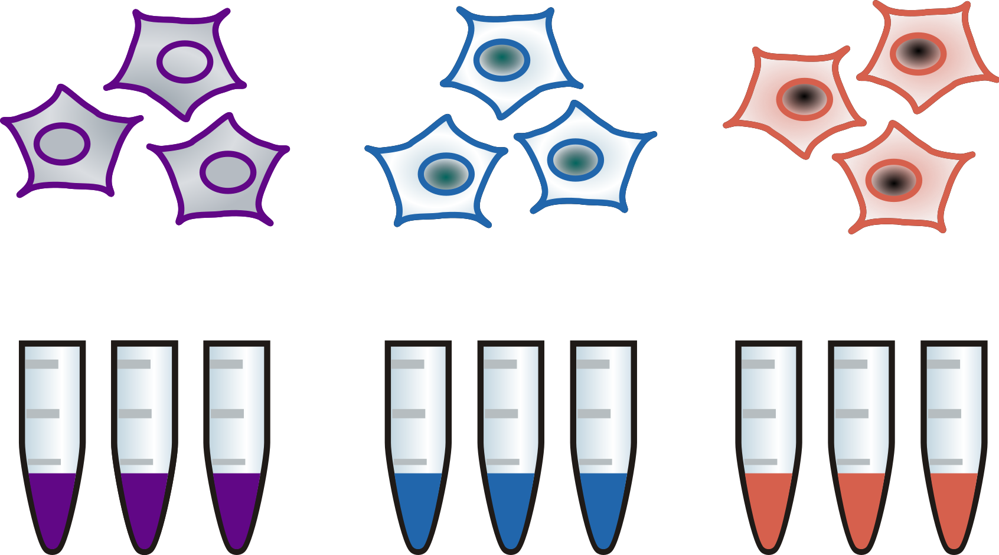
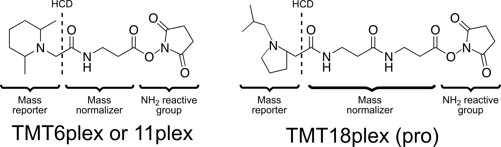
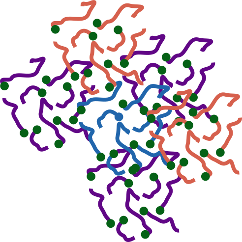
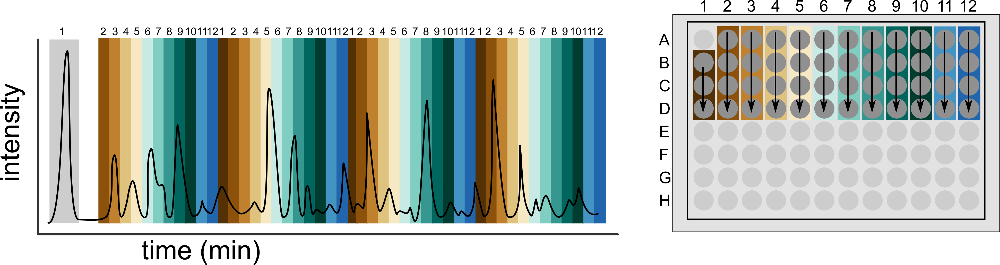
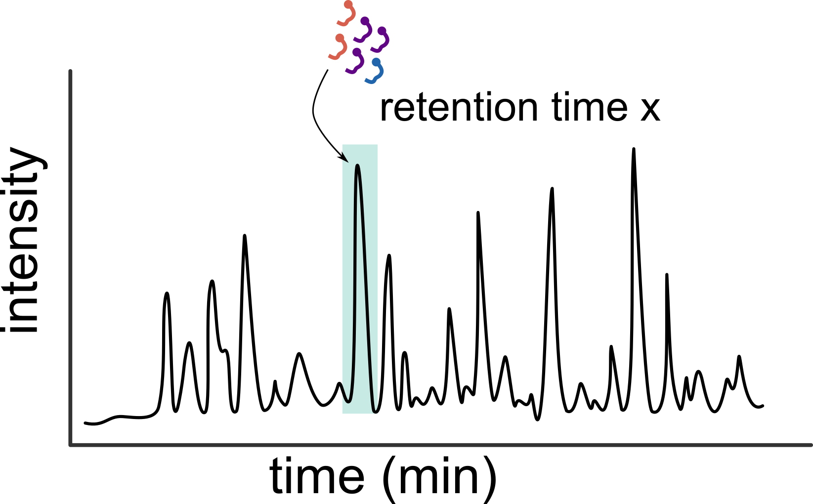
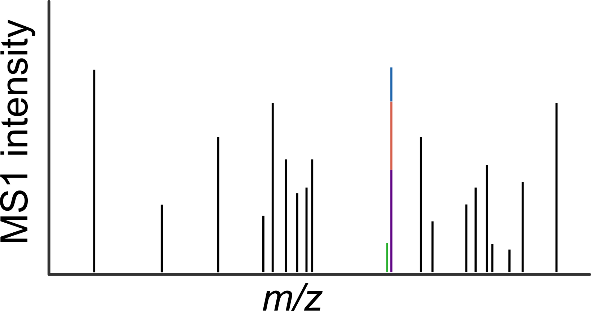
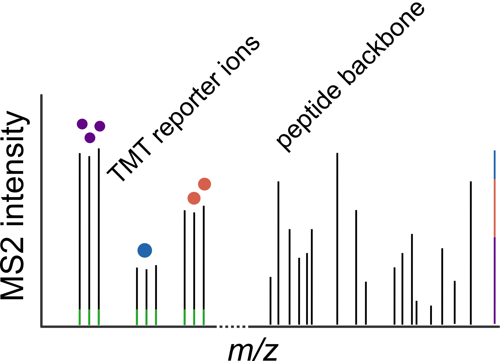
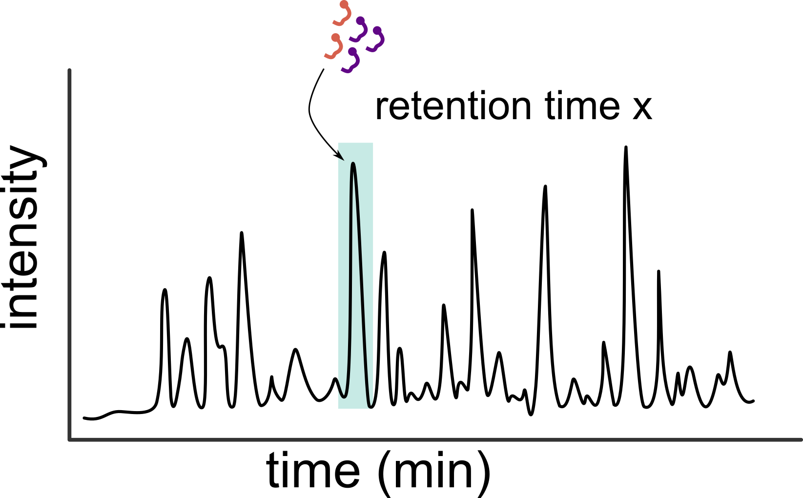
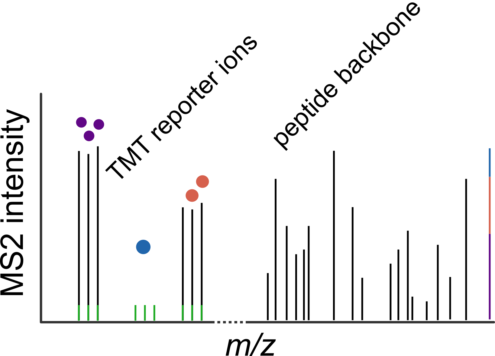

# **Tandem Mass Tag (TMT) Workflow**

## From Samples to Quantitative Protein Profiles

**Prerequisites**: This document assumes familiarity with basic mass spectrometry terminology (MS1/MS2, m/z, LC-MS, PSM).

TMT is an **isobaric labeling and multiplexing** strategy. Peptides from multiple samples are chemically tagged, **combined**, and measured together. Identification comes from peptide fragments, while quantification comes from **low‑m/z reporter ions** released from the tags during MS2.

The key idea for beginners:

- **Multiplexing**: multiple biological samples are mixed and analyzed together.
- **Quantification**: the relative abundance is read from **reporter ions** (one reporter mass per sample/channel).
- **Output**: a protein × sample matrix that typically has **very few missing values**, but needs careful interpretation around **background** and **ratio compression**.

---

## Contents

1. [Workflow overview](#workflow-overview)
2. [Experimental design](#experimental-design)
3. [Protein preparation and enzymatic digestion](#protein-preparation-and-enzymatic-digestion)
4. [Chemistry of TMT labelling](#chemistry-of-tmt-labelling)
5. [Optional: offline fractionation](#optional-offline-fractionation-highph-c18-ph-12)
6. [Liquid chromatography and mass spectrometry acquisition](#liquidchromatography-and-massspectrometry-acquisition)
7. [Building protein-level quantities](#building-proteinlevel-quantities)
8. [Missing values and background signal](#missing-values-and-background-signal)
9. [Co-isolation and ratio compression](#co-isolation-and-ratio-compression)
10. [Practical implications for data interpretation](#practical-implications-for-data-interpretation)

---

## Workflow overview

|  |
| :---- |
| Figure 1: Complete TMT workflow overview |

This documentation uses the same example design throughout (**9 samples** = **3 biological conditions** × **3 biological replicates**).

- **What happens to the 9 samples**: they are **labeled**, **mixed**, and then measured either as a **single LC‑MS run (single‑shot)** or after **offline fractionation** into multiple LC‑MS runs.
- **What the MS measures**: in MS1, all labeled versions of the same peptide appear as one combined signal; in MS2, the tag releases **reporter ions** that are used to quantify each sample.
- **What you receive**: a protein × sample matrix with very few missing values; interpretation focuses on **background signal**, **co‑isolation/ratio compression**, and **balanced sample loading**.

---

## Experimental design

Every TMT project begins with a carefully balanced design (same number of replicates per condition). In Figure 2, three experimental conditions are represented by three biological replicates each.

|  |
| :---- |
| Figure 2: Simple experimental design of a TMT experiment. |

In total, this example contains **9 samples**: **3 biological conditions** (different colours) with **3 biological replicates** per condition.

- **Balanced replicates**: include the same number of replicates for each condition so that any differences you see are due to biology, not just because one group has more samples than another.
- **Recommended replicate count**: at least **three** biological replicates; for subtle effects or noisy systems, **four to five** replicates can markedly increase statistical power.
- **Multiplexing capacity**: additional conditions (time‑points, doses, genotypes) can be included as long as the sample count stays within the tag set capacity (e.g. 6, 11 or 18 channels).
- **Multiple tag sets**: if your project outgrows a single set, divide samples across multiple sets, but ensure each set contains at least one complete replicate of every condition to preserve unbiased comparisons and simplify normalization.

---

## Protein preparation and enzymatic digestion

When the samples arrive, proteins are processed using the **SP3 bead-based clean-up workflow** (Hughes lab), which efficiently removes contaminants such as detergents and salts. Proteins are reduced with Tris(2-carboxyethyl)phosphine (TCEP) and alkylated with chloroacetamide, preventing re‑formation of disulphide bridges and introducing a uniform **+57.021 Da carbamidomethyl** modification on cysteines. The proteins are then digested into peptides (typically with **trypsin**, cleaving after lysine and arginine), generating peptides in a mass range that ionises efficiently and yields predictable MS/MS fragmentation patterns (Figure 3).

|  |
| :---- |
| Figure 3: Protein digestion into peptides using a protease e.g. trypsin |

---

## Chemistry of TMT labelling

The digested peptide mixture is subsequently labelled with isobaric Tandem Mass Tags. Figure 4 illustrates the two main chemistries you will encounter in the core facility: the original TMT 6/11‑plex reagents and the newer TMTpro 18‑plex set.

|  |
| :---- |
| Figure 4: Different Tandem Mass Tag (TMT) formulas for TMT6plex / TMT11plex and TMT18plex technology. |

Both reagents carry an N‑hydroxysuccinimide (NHS) ester group that reacts spontaneously with primary amines—namely the peptide N‑terminus and ε‑amines of lysine side chains—forming a stable amide bond.

Each tag can be understood as three conceptual parts:

- **Reactive group**: the NHS ester that enables covalent attachment the tag to peptides.
- **Reporter region**: produces a low‑m/z reporter ion in MS2 (one reporter mass per channel).
- **Balancer region**: compensates the reporter mass differences so every channel has the same total tag mass.

Heavy isotopes (¹³C, ¹⁵N) are distributed across reporter and balancer in a mirror‑symmetric fashion (dashed line in Figure 4) so that every tag has the same total mass even though each reporter mass is unique. This design ensures that peptides from different samples co‑elute and appear as a single peak in the first MS scan, yet remain distinguishable once the tag is fragmented.

A separate tag is assigned to every biological sample; unused channels can be filled with a pooled internal reference or left empty for future expansion. After labelling the reaction is quenched and the individual samples are combined into a single tube (Figure 5) so that all subsequent processing and MS acquisition steps affect every sample identically—a built‑in normalisation that boosts quantitative precision.

|  |
| :---- |
| Figure 5: Mixed digested samples after TMT labeling. |

Two consequences of this "mix‑then‑measure" design are worth keeping in mind:

- **Shared handling**: anything that happens after mixing (fractionation, LC, MS) affects all samples equally, which supports precise ratios.
- **Multiplexed measurement**: because samples are combined, quantification depends on reporter ions and is sensitive to **co‑isolation** effects (see [Co-isolation and ratio compression](#co-isolation-and-ratio-compression) below).

---

## Optional: offline fractionation (high‑pH C18, pH 12)

For deeper proteome coverage, the mixed TMT-labelled peptide sample can be separated **offline** on a C18 column operated at **high pH (here: pH 12)** before LC‑MS.

- **Why do this?** High‑pH reversed‑phase fractionation is considered **orthogonal** to the usual low‑pH LC gradient used for MS analysis: peptides that co‑elute under one condition often separate under the other. The practical effect is reduced complexity per run and typically more identifications.
- **How is it run?** Fractions are collected across the high‑pH separation and then **pooled ("concatenated")** to a smaller number of tubes to balance depth and instrument time.
- **What does it change?** Each pooled fraction is measured as a **separate LC‑MS run**, increasing total measurement time but improving depth.

In the example shown (Figure 6), we collect **48 fractions** and then pool them into **12 fractions**, which are then measured as **12 separate LC‑MS runs**.

|  |
| :---- |
| Figure 6: Optional offline high‑pH C18 fractionation (pH 12) with pooling: 48 collected fractions are combined into 12 pooled fractions, which are then measured in 12 separate LC‑MS runs. |

---

## Liquid‑chromatography and mass‑spectrometry acquisition

The multiplexed peptide mixture is injected onto a nano‑flow C18 column that is coupled directly to the mass spectrometer inlet (Figure 7).

|  |
| :---- |
| Figure 7: Mass spectrometer with an HPLC. |

During the chromatographic gradient peptides interact with the stationary phase according to their hydrophobicity and elute at characteristic retention times, producing a series of chromatographic peaks (Figure 8).

|  |
| :---- |
| Figure 8: HPLC chromatogram with a specific peptide eluting from the C18 column at retention time x. |

### MS1: one combined peak for all channels

When a peptides reaches the emitter tip they are ionised, and the mass spectrometer records a full‑scan spectrum of every ion present at that retention time. This first survey scan is called **MS1** (Figure 9).

|  |
| :---- |
| Figure 9: MS1 scan at retention time x |

Because all tags are isobaric, the same peptide labelled with different tags produces one undifferentiated peak in MS1. The peak intensity is the **sum** of contributions from all channels; a highly abundant peptide therefore produces a high MS1 intensity regardless of which sample it originated from.

### MS2: identification + reporter ions for quantification

The instrument software continuously evaluates the MS1 spectrum and selects precursor ions for fragmentation via higher‑energy collisional dissociation (HCD). The selected precursor is isolated in a narrow m/z window (typically ±0.7 Th), accelerated and fragmented. The resulting fragment ions are recorded in an **MS2** spectrum (Figure 10).

|  |
| :---- |
| Figure 10: MS2 scan at selected MS1 mass |

The MS2 has two distinct regions:

- **Peptide backbone fragments (high‑mass side)**: encode the amino‑acid sequence. Database search engines match these ions against an in silico tryptic digest of the reference proteome, assigning a peptide identity with statistical confidence.
- **Reporter ions (low‑mass side)**: These provide the readout of relative peptide abundance across all multiplexed samples. When a single, labile bond is cleaved (see dashed line in Figure 4), a reporter group is released that appears in a defined low-mass region of the MS2 spectrum—specifically, for **TMT 6-plex and 11-plex**, the reporter ions appear in the **126–131 Da mass range**. (For TMTpro 18‑plex, these reporter ions span **126–134 Da**.) Each isobaric tag produces a reporter ion of a unique mass (with small spacings due to isotopic labeling), allowing simultaneous quantification of all samples. By measuring the intensity (area) of each reporter ion peak in this region, the instrument reports the abundance of the peptide in each sample.
- **Figure 10 note (schematic)**: The reporter‑ion peaks are **not plotted at the exact TMT masses/spacing**. In this example, nine reporter peaks are shown **grouped into sets of three** to visually represent the three biological replicates per condition; this grouping is for educational clarity and does not reflect the true mass differences between TMT reporter ions.

---

## Building protein‑level quantities

A single protein typically yields many tryptic peptides, and the same peptide can be fragmented and quantified multiple times as it elutes (i.e., across multiple MS2 scans spanning its chromatographic peak). To move from peptide‑ to protein‑level quantities, reporter intensities from peptide‑spectrum matches (PSMs) assigned to the same protein (or protein group) are aggregated—most commonly by summing, but sometimes by taking the median or a variance‑stabilised summary. The resulting protein × sample matrix is the input for downstream analysis: quality control, normalization, statistical testing, and gene ontology enrichment.

---

## Missing values and background signal

An attractive feature of TMT is its low proportion of missing values.

- **Why missing values are low**: in a TMT multiplex, precursors are selected for MS2 fragmentation based on the **cumulative MS1 signal across all channels**. This means it can be sufficient if a peptide is abundant in just one (or a few) samples to cross the fragmentation threshold and be identified from the peptide-backbone region of the MS2 spectrum. Once identified, reporter‑ion intensities are quantified for **every** channel because the software knows exactly where to expect those reporter masses—even if the peptide was absent from a given biological sample.
- **What "missing" looks like in practice**: truly absent peptides usually show **low background** reporter signal rather than empty values, which often means no imputation is required downstream.

In the cartoon chromatogram of Figure 11 the peptide is missing in the blue replicates, yet its co‑eluting versions in the orange and purple samples still trigger fragmentation.

|  |
| :---- |
| Figure 11: Chromatogram with missing blue peptides |

The corresponding MS1 peak in Figure 12 is smaller—because the blue contribution is absent—but still surpasses the selection threshold.

|  |
| :---- |
| Figure 12: MS1 spectrum with missing blue peptides |

Consequently an MS2 spectrum is triggered and recorded (Figure 13). Reporter ions for the blue channels are reduced to low background counts rather than being entirely absent, which means no computational imputation is required downstream.

|  |
| :---- |
| Figure 13: MS2 spectrum with missing blue intensities |

---

## Co-isolation and ratio compression

Background counts can also arise from **co‑isolation**, which leads to a phenomenon called **ratio compression**.

- **Mechanism**: the isolation window around the precursor can capture a second, unrelated peptide of almost identical m/z (green peak in Figures 9 and 12). Reporter ions from this contaminant add to those of the target peptide.
- **Consequence (ratio compression)**: the observed fold change is distorted compared to the true biological difference (see green signal in the TMT region in Figure 13). This compression is often on the order of **~10–30%**.
- **Mitigation strategies**:
  - Narrow isolation windows
  - Offline pre‑fractionation (reduces co-eluting peptides)
  - FAIMS interfaces (ion mobility separation)
  - MS3-based methods on Tribrid instruments (SPS-MS3)

Interpreting very small expression changes (<1.2‑fold) therefore requires particular caution.

---

## Practical implications for data interpretation

Since all channels are mixed before the LC‑MS run, any variability introduced after labelling affects every sample equally and therefore cancels out in the final ratios. The two practical issues the analyst still needs to watch are **precursor dominance** and **channel misuse**.

### Precursor dominance — keep protein loads similar

Equally critical is the **protein load balance across channels**.

- **What happens**: if one sample enters the workflow with a markedly higher protein concentration, its peptide precursors dominate the **MS1** spectrum.
- **Why it matters**: data‑dependent selection targets the most intense ions, so an over‑represented channel effectively "decides" which peptides are fragmented, reducing sequencing depth for the other samples.
- **What you may observe in MS2**: the reporter ion of the overloaded channel can exceed the linear response range, while reporters from low‑load samples hover near the noise floor.
- **Downstream consequence**: peptides present only in the dominant channel can still produce faint reporter traces in other channels (background/interference), so comparisons between two low‑load channels can become **"noise vs noise"** and yield false positives.
- **Practical recommendation**: normalize protein concentration or protein input for enrichment-type experiments to aim for an approximately **1:1 ratio across channels** before labeling/mixing.

### Channel misuse — avoid unrelated samples in the same plex

Occasionally researchers are tempted to "fill" unused channels with leftover material from a different project.

- **Why this is risky**: an unrelated sample often has a different proteome; its unique, highly abundant peptides can monopolize MS1 intensity (similar to precursor dominance), but those peptides are biologically irrelevant to the current study.
- **What it causes**: irrelevant precursors consume sequencing time, increase background reporter counts, and inflate false‑discovery risk when ratios are calculated.
- **Practical recommendation**: if channels remain vacant after assigning all planned replicates and controls, it is safer to **leave them empty** or devote them to **pooled references** than to introduce an unrelated sample.

---

Keeping the input loads balanced and the channel roster relevant to the biological question ensures that every replicate is sampled with comparable depth and that the reporter ion signals fall into the linear, low‑noise region of the TMT response curve. Interpreting the resulting protein ratio matrix then becomes a question of biology rather than artefact.

---
